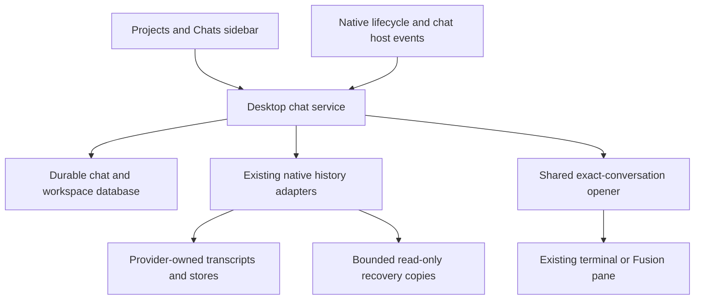

# Chats below Projects: design and recovery plan

Status: core implementation completed in source, with additional hardening still planned. See the [implementation and verification record](chat-section-implementation-2026-09-13.md) for the precise implemented scope, evidence, and remaining edge cases. The required placement is a **Chats section directly below the Projects section in the left sidebar**, opening chats in their existing terminal format. This document preserves the broader design and recovery roadmap; its proposed capabilities and targets are not all shipped guarantees.

The recommended default is the selected project's chats, with an explicit **All chats** filter. That filter default is an assumption, not a previously confirmed preference. All chats means conversations in Lina's registered or previously known folders, including Multi mode; it does not initiate an unrestricted scan of every folder on the computer.

## 1. Product behavior

A chat is a persistent conversation. A terminal pane is a temporary host for that conversation. One pane can host A, then B, then C; all three chats must remain discoverable after the pane closes. Resuming C must never silently reopen A or create a different conversation in C's row.

The feature should make existing agent conversations easy to find, open, and recover. It should reuse the terminal board and the existing Fusion/Open Fusion interfaces. A second generic chat engine or a replacement terminal renderer is unnecessary.

### Sidebar layout

```text
Lina
Orchestrator
Multi mode

Projects                         +
  Lina Terminal                  selected
  Website
  ...project list scrolls here...

Chats                            +
  [Lina Terminal ▾]  [Search chats]
  Fix terminal restart           Working
  Sidebar design                 Open
  Chat recovery                  Saved
  Earlier conversation           Needs recovery
  ...chat list scrolls here...

Settings
```

This is a structural wireframe, not a proposed visual reskin. Keep the existing dark styling, provider icons, typography, sidebar resize control, project counts, and reorder behavior. Projects remain above Chats; neither section becomes a child of the other. Settings remains at the bottom.

The current project list consumes the sidebar's flexible height, so simply appending chat rows would squeeze them out. Replace that middle region with two bounded, independently scrolling sections. Projects use their content height up to 40% of the available middle region; Chats takes the remainder. Both headings stay reachable. On very short windows, collapse project rows to a small scroll area, with an accessible collapse toggle, rather than hiding Chats or Settings. Preserve keyboard project reordering and keep chat rows outside project drag targets.[^1]

### Navigation and row actions

| Action or state | Required behavior |
| --- | --- |
| Select a project | Show that project's chats when using the default project filter; keep an explicitly selected All chats filter. |
| Enter Multi mode with the default filter | Show chats hosted in Multi mode and unassigned chats; do not keep a hidden project's filter without labeling it. |
| Open chat already running | Switch to its owning project/Multi board, reveal its existing pane, and focus it. Do not create another process. |
| Open saved or paused chat | Validate its exact identity and launch configuration, then open/resume it in its original project, or Multi mode when that project was removed. |
| New chat | Use the existing provider/agent picker. Create a durable provisional chat and pane intent before starting the provider. In All chats, require an explicit project or Multi folder in the picker. |
| Close pane | Stop/remove the pane using existing verified close semantics; keep the chat, history pointer, and app-owned draft. |
| Rename chat | Save a Lina title override; do not rewrite provider transcripts or confuse a title with an identity. |
| Archive / unarchive | Hide/show the chat in the normal list; preserve its transcript, resume recipe, and draft. Archiving an open chat does not stop it or remove its board pane. |
| View history | Open the existing paginated history reader without launching a process or sending a prompt. |
| Remove project | Preserve its chats and original folder metadata in All chats; do not recreate the project just to display history. |
| Missing store/folder/profile | Retain the row with a specific recovery action. Never turn an unavailable listing into an empty history list. |

Rows show title, provider/mode, a short activity or availability label, and an accessible overflow menu. Show project name in All chats. Search initially covers title, native ID, and project; transcript search stays in the history reader. Default order is last conversation activity, with a deterministic ID tiebreaker. Focusing, listing, or refreshing a title must not move every row to the top. Freeze sort placement during keyboard navigation and while a row menu is open.

Use ordinary focusable row buttons plus separate menu buttons, without nested interactive elements. Enter opens; menu actions work by keyboard; status is conveyed by text as well as color. Preserve focus when results refresh. Show loading, empty, partial, unavailable, and retry states separately. Use a named, persistent recovery notice only when a recovery problem exists.

Plain shells stay in Projects/Multi and outside saved Chats. A newly started agent without a native ID appears as **Starting chat** or **New chat**, not as a fake resumable transcript. Native subagents are not separate top-level chat rows. The Orchestrator remains its own conversation surface.

## 2. What the current code supports and where it falls short

The review inspected the working tree, including existing uncommitted work. Findings describe source behavior, not the installed application's behavior.

| Area | Existing evidence | Consequence for this feature |
| --- | --- | --- |
| Sidebar | `App.tsx` renders Projects and its list immediately before the Settings footer; the aside already has the label “Projects and chats.” | There is a clear insertion point but no actual Chats list yet. The label alone does not establish implementation. [^1] |
| Saved identity | `AgentThreadRef` carries provider/native ID. `threadRef`, `resumeRef`, and pending selection are separate. | Reuse exact native identity; never use pane ID, title, or folder recency as a substitute. [^2] |
| Restore | `restoreSession` restores a started threaded pane's current ID, and clears old process attention/background observations. The launch coordinator operates for hidden panes too. | Preserve those protections, but put startup behind durable recovery reconciliation. [^3] |
| Missing history | The current launch coordinator may start fresh when exact confirmation says `missing`; unavailable confirmation may still attempt the exact saved ID. | Add an explicit strict recovery policy for saved chat opens and restoration; a missing chat must stay missing in its own row. This is a deliberate behavior change. [^4] |
| History discovery | The Orchestrator history service lists native stores, excludes children, revalidates references, reads paginated prose, and reports partial discovery. | Reuse the adapters/readers; avoid building a second parser collection. [^5] |
| Discovery scope | Known folders come from current project/runtime inventory. Generic listing examines at most 64 scopes, with further candidate limits. | Persist known scopes after panes/projects close, and schedule fair incremental discovery across them. [^6] |
| History references | Reader references live in bounded process memory; the broker can refresh them after helper restart while its own memory survives. | Never persist an opaque `reference` as the durable chat identity. Rebuild it after a full app restart. [^7] |
| Resume configuration | Frontend `HISTORY_CONFIG_FIELDS` lists model/profile/Fusion settings, but backend generic discovery preserves only a narrower scope set. | Store complete, validated launch recipes when Lina observes/creates a chat; generic discovery cannot reconstruct all original settings. [^8] |
| Workspace persistence | React effects write project and Multi snapshots to separate localStorage keys; parse failure yields an empty list. | No application-level transaction spans chat ownership, layout, selection and pane closure. Do not use this as the only recovery authority. [^3] |
| Drafts | `sessionDrafts.ts` uses a module Map keyed by pane ID. `forgetSessionDraft` runs during pane removal. | Fusion/Open Fusion drafts survive unmounts but not a full renderer/app restart; move recoverable drafts to chat identity. [^9] |
| Shutdown | `window-all-closed` disposes runtime services and sends host shutdown messages followed immediately by `kill()`. Several `before-quit` callbacks start asynchronous close operations without awaiting them. | Add one coordinated shutdown owner and an acknowledged drain protocol. Current code does not prove provider flush completion. [^10] |
| Terminal scrollback | `terminalHistory.cjs` keeps xterm cells and modes in memory. | Useful for reattaching a renderer to a living host; it is not a disk archive or a recoverable agent conversation. [^11] |
| Codex Web | It has its own `codex-web/codex-home`; the shared capability catalog marks it non-threaded and history provider enumeration omits it. | Its native-looking UI does not establish shared history/recovery support. Add and verify a dedicated store/identity adapter. [^12] |

## 3. Separate conversation, pane, and execution state

Use three independent identities:

1. **Chat ID:** a Lina-generated UUID that survives pane closure, restart, title changes, and recovery. It exists before the provider has produced a native ID.
2. **Native conversation identity:** provider family, actual store identity, validated original conversation folder, and native thread ID. This selects the provider's saved conversation.
3. **Pane/run identity:** pane ID, app boot ID, host generation, launch token, CLI invocation, and conversation selection revision. This determines which live process may receive input or update the current binding.

Do not make the native tuple globally less strict than the existing `conversationKey`/backend identity rules. Centralize normalization in one shared desktop module and preserve Windows case/separator behavior, UNC roots, provider home isolation, and Kimi/Kimi-custom shared-store semantics. Resolve real paths when accessible; an unavailable path must retain its last verified key rather than being guessed or lowercased on every platform. Store path aliases explicitly after verified relocation, without bulk-merging histories by folder name.[^8]

The same native conversation discovered as a normal pane and as Fusion should produce one chat with proven launch-mode metadata, not duplicate rows. A mode change is explicit; do not infer Fusion from a Codex conversation merely because a Fusion pane shares its folder. Persist root ownership when observed. Keep custom profile identity separate from physical store identity: a shared custom Claude home does not prove which profile created every historical conversation.[^5]



Chat state must not be a single overloaded `status` field. Store independent dimensions: native identity state (`provisional`, `pending`, `confirmed`, `unavailable`); history availability (`unchecked`, `available`, `missing`, `partial`, `unavailable`); archive state; and last durable run outcome (`idle`, `interrupted`, `unknown`, etc.). Overlay current live activity only from an owner verified in this boot. “Saved” means there is a known persisted conversation, not that the agent completed its work.

### A → B → C in one terminal

On credible native selection of B, persist a pending B record and retire A as that pane's current input/resume target in one transaction. Keep A as history. When B is confirmed in the correct store, bind B with the new selection revision. Repeat for C. If C is still pending at shutdown, store C's candidate ID and pending state; never serialize A or B as C's replacement.

Late A/B events, metadata replies, restored transcript events, and background children cannot change C's current binding. A deliberate return to A must produce a new selection revision; old approvals or queued A input still do not become valid. Use the runtime's existing generation/invocation/root checks as evidence producers, not a second title-based selection mechanism.[^13]

Some native CLIs only expose a new conversation after its first prompt. If a user types `/new` and the provider emits no trustworthy identity event before a crash, Lina cannot know the unsaved native ID. Keep the durable provisional/new intent when Lina initiated the action. For an entirely native, unobserved switch, report the last verified chat and the recovery uncertainty; do not claim the empty new chat was recovered. Discover candidates for deliberate selection without assigning the newest transcript automatically.[^13]

## 4. Durable storage decision

Use **one local SQLite database**, proposed at `app.getPath('userData')/chat-workspace.sqlite`, managed by a single desktop backend worker. It stores the chat catalog and the recovery-critical workspace snapshot together. Small UI preferences such as sidebar width can remain in localStorage. This is desktop-local state and belongs in `apps/desktop`; the hosted account backend is not involved.

SQLite is preferred over another growing JSON blob because chat binding, launch intent, draft delivery state, and pane removal need transactions and uniqueness constraints. A local probe successfully loaded `node:sqlite` in this checkout's Electron 42.11.2 / Node 24.19.0 runtime, reporting SQLite 3.53.3. That establishes a dependency-free candidate for the worker, not packaged compatibility or crash durability. The implementation must also verify the packaged helper and supported build/runtime targets. The Node 24 API documents `DatabaseSync` and backup support.[^14]

Set and verify `journal_mode=WAL`, `synchronous=FULL`, foreign keys, a bounded busy timeout, and schema version. Keep synchronous database work off the Electron main/UI thread. A write is acknowledged as saved only after its transaction commits. WAL with FULL supplies the intended committed-transaction durability under SQLite's documented storage assumptions; it cannot make a provider transcript and Lina's database a single atomic transaction.[^15]

Keep the database on local storage. If userData is redirected to an unsupported network location, use a verified local per-profile storage location or expose recovery storage as unavailable; do not silently use WAL on a network filesystem. Do not sync/copy a live SQLite file through the account server or a cloud folder as a backup protocol.[^16]

### Proposed records

| Record | Minimum persisted fields and rules |
| --- | --- |
| `app_runs` | Boot UUID, app/schema version, startup time, shutdown requested/completed times, reason, clean/unclean result, last committed sequence. Commit the new running marker before admitting launches. |
| `projects` / `workspace_state` | Stable project ID, label, original/canonical folder, ordering, removal marker; Multi state, selected project/view/chat, board pane list and layout/split membership. |
| `known_scopes` | Provider/store/folder identity, discovery progress, last successful scan, completeness/error. Project removal does not delete scope provenance. |
| `chats` | Stable chat ID; native tuple/candidate; root provenance; original folder; optional project ID; title override and discovered title; activity times; availability; archive flag; versioned launch recipe; row revision. Unique verified native tuple; provisional rows may lack it. |
| `pane_bindings` | Pane ID, chat ID, boot ID, generation, launch token, invocation/selection revision, current/pending binding, open/closed/paused intent. Old bindings are historical across a new boot. |
| `launch_operations` | Idempotency key, chat/pane target, requested new/resume mode, intent/starting/confirmed/failed/unknown state. Records intent, not permission to repeat a partially observed launch. |
| `drafts` / `submissions` | Chat ID, app-owned text and attachment references, monotonically increasing draft revision; submission ID, source revision, intent/dispatching/accepted/unknown state. Exclude secrets and transient approval grants. |
| `recovery_copies` | Chat ID, source revision, captured time, message ranges, completeness and truncation reason, bounded text data. Never usable as a native resume identity. |
| `migrations` | Source schema/checksum, completed version, backup identity and verification result. Import operations are idempotent. |

Store only allowlisted launch options and stable references to credential profiles; never API keys, OAuth tokens, entire environment variables, or reconstructed shell strings from transcript data. Resolve the current executable and credentials through existing launchers. If a saved profile/model was removed, show configuration recovery; never pick a different account or paid provider silently. Resolve `default-custom` to the actual selected profile when capturing new ownership, while leaving unverifiable legacy defaults marked uncertain.

The backend owns revisions. Renderer mutations carry operation IDs and expected revisions; stale full snapshots cannot overwrite a newer native selection or resurrect a closed pane. A transaction closing a pane preserves its chat/draft while marking its reopen intent closed. A native selection transaction retires the old binding and saves the new candidate together.

### Write timing and failure behavior

| Change | Persistence boundary |
| --- | --- |
| Create/resume/close/archive/rename | Commit identity/intent or metadata before returning a durable success. Start external effects only after their intent is committed. |
| Native ID/selection event | Capture in the backend before depending on renderer consumption; commit pending/confirmed transition promptly and expose save state separately from live state. |
| App-owned draft edit | Coalesce to 250 ms with a 1 s maximum wait while continuously typing; flush on explicit send, blur/close, and normal shutdown. “Saved” is tied to the acknowledged draft revision. |
| Layout/filter/selection | Coalesce within 500 ms; final flush on normal exit. This state can tolerate bounded recency loss during an abrupt crash. |
| Title/activity refresh | Coalesce within 1 s; no writes for every PTY chunk, animation, or unchanged runtime snapshot. |
| Submission | Commit dispatch intent before transport write, then record the result. Preserve an uncertain outcome when a crash falls between external write and acknowledgment. |

Disk full, read-only storage, busy timeout, or worker failure must produce a stable “Changes could not be saved” state. Keep the last good durable data, preserve the newest unsaved edits in memory, and allow copying text. Stop claiming durable success and pause new app-managed launches/sends that require persistence. Existing native processes may keep running; do not kill them solely because storage failed. Native input bypassing the app's composer cannot be made transactional by this catalog.

## 5. History ownership, recovery copies, and limits

The provider's native store remains authoritative for resuming an agent with its full context. The current history reader extracts human prose and validates source revisions; it does not archive every native tool record, attachment, or internal state.[^5] Lina's database owns catalog metadata, app-owned drafts, and workspace recovery state.

Include a bounded **read-only recovery copy** for recently observed/read chats. Proposed initial limits are 2 MiB of normalized message text per chat and 200 MiB total, with least-recently-used eviction of copies only. Refresh after a completed turn, on history view, and opportunistically before close; batch active-stream refresh no more than once per five seconds. Store complete message/range boundaries and source version, capture time and coverage. If a transcript is larger, retain a clearly labeled recent portion. Do not pretend two different native source revisions form one complete snapshot.

Normal app restart uses native history; a stale recovery copy does not replace a readable native transcript. If native history becomes unavailable, offer **View recovery copy** with its timestamp and missing-range notice. A copy cannot restore the native execution context. “Start new chat with this text” is a separate, deliberate action that creates a new ID and requires review of the text; it is not automatic recovery.

Catalog rows, archive choices, launch recipes and unsent drafts are not subject to that recovery-copy eviction. Drafts have the existing composer input limit; oversized migration data is reported, not truncated silently. Recovery content is private local text, protected by the user's app-data permissions; it is not encrypted merely because it is in SQLite. No cloud upload or transcript logging is part of this feature.

Metadata backups do not back up provider stores. Full native backup/restore across providers, attachment binaries, and arbitrary external file deletion are separate work. App uninstall with data removal, disk failure, or intentional provider-history deletion cannot be advertised as lossless recovery. For local attachment references, retain original paths and show unavailable attachments after restart; temporary files owned by Lina need copying into app-owned attachment storage before being acknowledged as attached.

## 6. Normal shutdown and update protocol

Create one idempotent `prepareShutdown(reason)` coordinator, replacing independent cleanup paths that currently race. It must run for the main window close, explicit Quit, restart-to-update, and supported OS session-end notifications. Multiple events share one in-flight promise and an explicit final-exit guard.

Electron documents that Windows shutdown/logout can bypass application quit events, and updater-driven close ordering differs from ordinary Quit. Therefore continuous persistence is the primary protection; shutdown flush is a final improvement, not the foundation.[^17] The window's Windows `query-session-end`/`session-end` events offer additional notification, but the latter cannot prevent termination.[^18]

Proposed normal-exit budget: **5 seconds total**, not five seconds per pane. All waits have deadlines. No indefinite wait for a model response or network request.

1. Mark the app closing and reject new launch/send admissions. Commit shutdown intent. Suspend automatic Orchestrator dispatch and new background follow-ups while preserving their historical records. Preserve the previously open pane list; teardown must not make every pane look deliberately closed.
2. Ask the renderer to flush changed app-owned drafts and layout by revision, with a short deadline. Continue if it is gone/unresponsive; backend-owned chat identities must not depend on this reply. On ordinary exit, a failed durable flush exposes Retry/Copy/Exit without saving, not a false successful save.
3. Commit a recovery snapshot of all currently observed roots and pending selections before stopping hosts. Record any active turn, outstanding submission, pending approval, or background work as needing reconciliation. Do not persist old approval authority.
4. Ask each live host to prepare for shutdown using provider-appropriate interruption/stop behavior. Capture last observed IDs and outcomes, drain event writes, and acknowledge host state. An acknowledgment means the host responded; it does not prove a third-party CLI fsynced its entire transcript.
5. Stop owned child processes, wait for bounded exit acknowledgment, then force termination of remaining verified owned process trees. Keep necessary provider gateways alive until their clients stop. Close the history/discovery worker after its accepted work has drained or been explicitly abandoned. No new model turns are issued to “summarize” or “continue” during shutdown.
6. Persist final outcomes and mark `shutdown_complete` only after the required database writes and owned-process reconciliation succeed. Record a partial/forced shutdown if any outcome remains unknown. A clean application exit can still contain an interrupted agent task; those are distinct fields.
7. Close the store, dispose observers/bridges, and exit once. For installation, call `quitAndInstall` only after preparation succeeds, with a flag allowing final close events through without repeating teardown. Do not depend on the updater's later `before-quit` callback to save a renderer that is already closed.

During Windows logout/restart, do only bounded best-effort work allowed by the available deadline; do not promise the normal five-second budget or hold OS shutdown indefinitely. During sleep/hibernate, checkpoint opportunistically and reconcile liveness on wake rather than marking the app cleanly shut down or creating replacement processes.

Add parent-death cleanup for PTY, Fusion and Open Fusion hosts. The PTY host currently handles the explicit `shutdown` command; its final stdin reader does not establish a cleanup-on-parent-disconnect guarantee.[^10] Verify Windows owned-process cleanup and child exit evidence. A saved PID alone is never sufficient to kill or reattach a process after restart: PIDs can be reused. Use current boot/host ownership and process-start evidence; if an older child is unresolved, hold that chat for recovery rather than starting a duplicate.

## 7. Startup and recovery protocol

Restoring the catalog, restoring a board pane, reconnecting to a still-live host, and resuming a native agent are different operations. Recovery runs in that order, and each has an observable result.

1. Acquire the app's per-profile single-instance ownership before opening a writable store or starting hosts. Development and QA profiles use separate userData directories. A second launch focuses the existing instance; it does not independently reopen every chat.
2. Open the database, inspect schema and previous run state, recover SQLite's WAL normally, and perform required validation/migration. Preserve suspect databases before repair. Commit the new boot record before starting agents.
3. Send the renderer the durable projects, pane layout, Chats rows, filter/selection and drafts. Show usable navigation before history scans and provider startups finish. A missing database/renderer cache must not silently create an empty replacement over recoverable data.
4. Reconcile current main-process hosts before any launcher runs. After a renderer-only crash, reattach the renderer to verified living panes using runtime snapshots and terminal replay; do not call the full new-process restore path. After a full app crash, old persisted live statuses are historical and all ownership needs fresh verification.
5. Rebuild private history references from durable native tuples through the trusted backend. Confirm exact store/root/folder/ID and resolve the saved launch recipe. Probe missing folders, profiles, binaries or provider login independently; an offline account does not mean local history is deleted.
6. Build a restore queue for the previously open eligible panes. Do not create PTYs for the entire historical chat list. On a clean exit, preserve the existing behavior of reopening previously started agent panes in bounded concurrency (initially two launches at once), with selected pane/project first. Paused/closed panes stay paused/closed. Ordinary shell startup behavior stays governed by its existing pane policy; it is not a recovered chat.
7. After an unclean exit, restore every pane placeholder and draft immediately, but hold chats with interrupted turns, unknown sends or unresolved process ownership in **Needs recovery**. Idle, confirmed, supported chats can resume according to restore preference after ownership checks. Offer **Resume** per chat and a **Resume eligible chats** action; neither injects previous prompts. Do not restart every active workload automatically after a crash.
8. Commit a new launch intent/reservation before process creation. Share a backend open reservation between sidebar, History, startup restoration and Orchestrator. Once created, require the new native root ID to match the requested one before marking recovery complete. Show “Opening” until then; launch acceptance alone is not proof of a recovered conversation.
9. Refresh histories incrementally, retain cached rows on scan failure, and resolve remaining recoverable candidates without overwriting user choices. Restore focus/scroll once by revision; late background recovery should not steal focus from the user.

Provide a persisted restore preference: **Reopen previously open chats** (default for clean exits) or **Restore layout and open chats when selected**. Crash recovery holds described above apply regardless. Never replay prompt text, approval decisions, queued input, or autonomous continuation as a side effect of restoring a window. If a provider automatically continues work merely by resuming, it is ineligible for automatic reopen until a verified paused-resume path exists.

### Recovery cases

| Failure point | Recovery behavior / invariant |
| --- | --- |
| Normal close with idle chats | Restore the exact chats and previous pane layout; old closed history remains closed. |
| Close while agent works | Keep identity and an interrupted/unknown outcome; resume conversation context without claiming the tool finished. |
| Task Manager kills renderer only | Main process/store survive; recover renderer from authoritative state and attach to existing host. Zero duplicate PTYs. |
| Main process killed / machine reboot | New boot invalidates old runtime authority; recover committed catalog and evaluate owned-process uncertainty before any resume. |
| Power loss during SQLite transaction | Recover the last committed state; unacknowledged writes may be absent. State this boundary, and verify through fault injection separately from actual power-loss claims. |
| Shutdown while C selection is pending | Recover C's pending ID/state; no automatic A/B fallback. Retry exact confirmation or show recovery choice. |
| Native ID persisted by provider but event never reached Lina | Keep provisional row; show matching candidates with provenance for deliberate selection. No newest-file guessing. |
| Create intent committed, spawn outcome unknown | Reconcile same-boot host if possible; otherwise hold as unknown. Never issue another new-chat creation just because an ACK was lost. |
| Prompt written, send ACK lost | Keep submission as unknown. Read available native evidence; never auto resend, and do not deduplicate on text equality alone. |
| Storage commit succeeded, renderer ACK lost | Repeated operation ID returns the existing result and revision, without duplicating chat/draft or repeating a send. |
| Close committed, UI crashes before removing tile | Closed intent wins; do not resurrect the pane. Chat/draft remain in catalog. |
| Chat switched while an old draft save was in flight | Save by chat ID and revision; never attach the old draft or send to the new conversation. |
| Provider transcript still being written / corrupt final line | Keep the row and retry bounded reads; preserve last complete snapshot. A partial discovery is not proof of deletion. |
| Native transcript moved/deleted/unreadable | Distinguish missing from unavailable; show retry/location/profile recovery or timestamped recovery copy. Do not silently create fresh. |
| Project removed, folder still exists | Keep original chat ownership metadata; open deliberately in Multi without recreating the project. |
| Folder moved, external drive disconnected, worktree deleted | Retain original path and history; ask for a new location only when opening. Require provider-specific relocation support and validation before changing resume cwd. |
| Account/profile/model/CLI unavailable | Keep chat and draft; provide setup recovery without changing provider/home/account implicitly. |
| History helper or database worker crashes | Restart boundedly, invalidate temporary cursors/references, retain durable rows; unresolved mutations are retried by operation ID, not replayed as new effects. |
| SQLite corruption or interrupted migration | Preserve files, try verified backup, then rebuild discoverable native metadata. Report missing Lina-only metadata/drafts explicitly; never auto overwrite the suspect originals. |
| Sleep/network loss | Keep identity; recheck actual process and account connectivity on wake. Do not mark every disconnected pane completed or duplicate it. |
| Same chat clicked rapidly or opened concurrently by Orchestrator | One shared reservation, one owning pane, all callers receive the same pending/open result. |
| Previous version installed over new schema | Refuse destructive downgrade/write; keep database/backup and offer compatible version recovery. No empty-reset fallback. |

## 8. Drafts, queued messages, approvals and interrupted tools

Persist Fusion/Open Fusion drafts by chat ID, not pane ID; migrate the existing hook to a chat draft controller that can still serve unmounted panes. Closing a pane must no longer call away the only copy of its draft. A provisional chat owns its draft until the native binding is confirmed. A selected-conversation change saves A's draft before switching the composer to B's draft.[^9]

For app-owned sends, track `draft -> intent -> dispatching -> accepted/unknown` with a unique submission ID. Commit intent before transport; clear only the sent draft revision after durable acceptance bookkeeping. If the user typed a newer revision during the send, retain it. On restart, uncertain text is shown in a recovery item with **Review / Copy to draft / Dismiss**, not silently inserted and sent. Existing queued steering/background follow-ups are restored as historical or reviewable pending items, never as execution authority.

Typing directly inside a native CLI belongs to that CLI's composer. Lina must not record every raw terminal keystroke to reconstruct it: that would also capture password prompts and control sequences. Native unsent input is recoverable only where an adapter exposes a verified draft API. V1 must plainly distinguish app-owned saved drafts from native composers whose unsent text is not captured. The UI cannot claim “all drafts saved” for those panes.

An interrupted tool may already have edited files or launched an external process. Resuming its conversation does not roll those effects back. Restore a contextual interrupted label, then let the native agent reconcile work when the user continues. Old permission/approval tokens and tool request IDs are invalid after a process restart. Display historical questions as history; only a freshly observed live request can render an actionable approval control. Preserve existing Orchestrator input/ownership fences.

## 9. Provider support and launch recipes

Implement a capability contract per provider: `canDiscover`, `canReadTranscript`, `canConfirmExactRoot`, `canResumeExact`, `canObserveSelection`, `canRestoreDraft`, `canShutdownGracefully`, and `canResumeWithoutRunningWork`. Each capability may be verified, partial, unsupported, or unavailable at runtime. Do not extend the existing `threaded: true` flag to imply all of them.

| Provider/mode | Current foundation | Work required before claiming reliable Chats recovery |
| --- | --- | --- |
| Claude / Open Claude Code | Preassigned/native IDs, exact confirmation, selection instrumentation, custom home distinction. | Durable pending/current transitions; concrete profile identity; custom-home validation; missing transcript stays recoverable rather than fresh fallback. |
| Codex / Open Codex | Native ID discovery, selection guards and exact resume, separate Open Codex home. | Store distinction in every layer; zero-ID startup and unobserved `/new` limits; verified paused resume and shutdown behavior for actual bundled/global versions. |
| Fusion, Claude or Codex planner | Planner-owned native identity, rehydration, planner/executor settings and background task lifecycle. | Persist full two-role recipe/provenance and drafts. Invalidate stale executors and approvals; do not rediscover Codex Fusion provenance by folder alone. |
| Open Fusion | App-owned OpenCode home, exported/read history and existing session replay. | Persist mode/models/store cutoff/provenance; bounded server shutdown; exact session reattachment and draft recovery. Never fall back to global OpenCode. |
| OpenCode / Cursor / Gemini / Kimi / Kimi custom / Qwen / Grok | Existing discovery/confirm/resume adapters with varying completeness. | Audit each capability independently using actual supported versions. Preserve partial/unreadable results; do not assume root verification from a placeholder `found` result. |
| Codex Web | Native bundled TUI and private app-owned Codex home, currently outside shared threaded history. | Add provider identity/type, private-home discovery/read/confirm, selection telemetry, exact CLI resume and account-sensitive readiness; verify native root after reopen. Until then, show an open-only row with unavailable recovery rather than a false saved-history promise. |
| Plain terminal | PTY/scrollback and pane lifecycle. | Excluded from saved Chats. Existing shell panes remain available on the board. |

Codex/Claude/Open Codex native selection acceptance recorded in the earlier repair document is useful prior evidence, but it is not proof of every currently installed CLI or this unimplemented recovery system.[^13] Grok's adapter can report current-context-only history; OpenCode exports have bounded size/time limits. Keep those distinctions visible.[^5]

Store the original launch mode and allowlisted model/profile settings when observed; imported native chats may be readable but have incomplete launch metadata. Opening such a chat uses only an unambiguous native default, or presents a configuration picker when the home/profile/mode cannot be established. No model call is needed to classify, list, save, or open a chat.

## 10. Shared services and integration boundaries

Introduce an app-level `chatService` independent of Orchestrator enablement. It owns catalog queries, native reconciliation, recovery status and open reservations. The Orchestrator, History reader, sidebar and future clients use the same service rather than maintaining competing conversation identities.

Expose narrowly scoped workspace-window IPC, with main-process sender validation:

| Operation | Contract |
| --- | --- |
| `chats:list` | Filter/query/cursor; returns bounded metadata rows, catalog revision and discovery completeness. No transcript scan on every render. |
| `chats:changed` | Batched changed chat IDs / revision / recovery health; resync if renderer missed revisions. |
| `chats:open` | Chat ID + operation ID + expected row revision; returns existing/starting/blocked pane and precise reason. Backend revalidates identity. |
| `chats:new` | Validated project/Multi scope and launch recipe; atomically creates provisional chat/pane intent. |
| `chats:update` | Rename/archive plus expected revision; no caller-supplied arbitrary transcript path or credentials. |
| `chats:read` / `search` | Chat ID resolved by backend to current private reader reference; reuse page/source-version rules. |
| `chats:draft` | Get/save by chat ID and revision; send uses a separate existing validated input route. |
| `workspace:checkpoint` / `recovery:state` | Versioned workspace changes, boot/revision metadata, recovery outcomes and flush acknowledgment. |

Extract the existing focus/resume/create behavior from the `App.tsx` relay action into a shared opener/controller, preserving board placement, generation fences, exact-native confirmation, and existing stop verification.[^8] Backend admission is authoritative; React StrictMode or renderer reload cannot create a second reservation. Update the Orchestrator's existing history operations to adapt to this service without changing its permission/target-selection contract.

Do not add mobile write endpoints, account synchronization, billing hooks, admin screens or server dependencies. The read-only mobile bridge may reuse the backend service later under its existing authorization limits; this plan does not widen its API.

## 11. Discovery and performance

Render catalog metadata immediately, then reconcile known provider/folder scopes in a background worker. Initial query page: 50 rows, maximum 200; render a bounded list/window when hundreds are visible. Use revision-bound cursors and a stable sort snapshot so newly active chats do not cause duplicate/missing pages. A query/filter change cancels or ignores old results by generation.

Deduplicate refreshes, cap concurrent native discovery (initially two), prioritize the active project and open chats, and rotate through remaining scopes. Keep the existing parser safety limits but report incomplete scans and continue work across pages rather than permanently omitting scope 65 onward. Deduplicate Kimi aliases and shared stores before scanning. Time out individual adapters without discarding other results.

Use runtime/native events to update known chats; schedule periodic reconciliation only while useful (proposed 30 s for the active scope, five minutes for background metadata, plus explicit Refresh). Hidden/collapsed Chats can receive lightweight metadata changes without reading transcripts. Preserve the history reader's bounded pagination and source-version checks.[^5] Recovery-copy work is lower priority than identity commits and should stop first under load.

Implementation performance targets, to measure on a documented Windows fixture: first 50 cached rows within 150 ms of the list request; no main-thread native-store scan; no terminal creation from listing; no more than two simultaneous startup launches; no database write for unchanged terminal redraws. Exercise 10,000 indexed chats and at least 100 known provider/folder scopes. These are acceptance targets, not measurements from this review.

## 12. Backups, migration and rollback

Use consistent SQLite backup support rather than copying only an open `.sqlite` file and ignoring its WAL. Keep three verified rolling daily metadata backups, plus a protected pre-migration backup; generate after a successful open/validation and as part of upgrade preparation when needed. Validate each new backup before rotating the older good one. Recovery copies can be rebuilt/evicted; report their coverage separately from the catalog and drafts.[^19]

1. Introduce a schema/versioned store and a boot gate. Load legacy localStorage without immediately starting its panes. Import projects, Multi panes, layout, current refs, older refs, pending state and allowlisted settings in one transaction.
2. Derive chat rows from every current and previous valid reference; preserve paused pane identity and provisional launch intent. Do not turn a legacy ambiguous `resumeRef` into a current chat. Preserve duplicate/malformed records for diagnostics/recovery without sending them into launchers.
3. Import native history lazily from known scopes; mark external/unattributed origin and missing configuration honestly. Merge by verified native identity, never by title. Keep user overrides and archive flags during rescans.
4. Mark migration complete only after commit and a read-back validates ownership/layout references. A crash during import retries idempotently. Keep a source checksum and a frozen legacy backup. Native provider stores are read, not rewritten.
5. Switch startup/workspace authority to the new backend snapshot. Keep legacy localStorage data for the compatibility window, but do not repeatedly re-import it after migration or let a stale browser cache override the database.
6. Reject newer unknown schema versions for writes. Rollback requires a documented compatible export or restoring the protected pre-migration snapshot, with disclosure that later Lina-only edits would be lost. Never reset storage simply to make an older binary launch.

If database recovery fails, preserve the original database and sidecars, offer the most recent validated backup, and rebuild discoverable native rows into a separate recovery store. Lost unsent drafts and Lina-only metadata cannot be reconstructed from native transcripts unless a valid backup contains them. Do not advertise such a rebuild as complete restoration.

## 13. Implementation packages and ownership

All paths below are relative to `apps/desktop` unless prefixed with `docs/`. New filenames are proposals. Implement sequentially with a passing gate for each package; the feature is not complete at the sidebar milestone.

| Package | Main changes | Completion gate |
| --- | --- | --- |
| 1. Contracts and persistence foundation | New `shared/chatIdentity.cjs`, typed chat/recovery contracts, `backend/chatStore.cjs` and worker; schema, transactions, revisions, idempotency and backups. | Actual Electron worker loads SQLite; torn/failed/duplicate writes and backup recovery pass; no new runtime behavior enabled. |
| 2. Backend capture and legacy migration | New `backend/chatService.cjs`; main runtime/host event capture; full recipe/provenance; known scopes; import/boot gate; backend workspace authority. | Hidden A/B/C selection survives renderer death; migration is restart-safe; closing panes cannot erase chats/drafts or resurrect layout. |
| 3. One exact chat opener | New shared frontend opener/controller; adapt `orchestratorHistory.ts`, `terminalLaunchCoordinator.ts`, `orchestratorIntegration.cjs`, preload/types; strict missing-chat policy and backend reservations. | Sidebar/API/history/Orchestrator concurrent opens share one owner; wrong-home/candidate/profile cases block explicitly; partial launch never retries as a new chat. |
| 4. Chats sidebar and history integration | New `frontend/components/ChatsSection.tsx`, row/filter/list model and styles; modify `App.tsx`, `styles.css`; reuse reader. | Chats directly below Projects at supported sizes; keyboard/search/archive/focus and provider labels work; cached list remains useful on discovery failure. |
| 5. Drafts, recovery copies and provider gaps | Update `sessionDrafts.ts` and Fusion/Open Fusion composers/hosts; durable submissions; copies; Codex Web identity/history adapter; remaining provider audits. | Saved app drafts survive close/restart; unknown send is never replayed; each advertised provider has a checked support matrix; partial copies are labeled. |
| 6. Shutdown and startup recovery | New `backend/shutdownCoordinator.cjs` and recovery coordinator/controller; modify main lifecycle, updater, PTY and chat host drain/parent-death paths. | Normal exit, update exit, renderer kill, main kill and forced host exit scenarios pass with exact IDs and bounded time; no duplicate children or automatic sends. |
| 7. Release acceptance and documentation | New recovery Electron/native fixtures, provider matrix, packaged checks; update root `docs/frontend.md`, `backend.md`, `terminal-runtime.md`, `preload.md`, `scripts.md` and this record. | Entire acceptance matrix passes or unsupported capabilities are explicitly excluded from the product promise; packaged results recorded separately from source and installed results. |

Do not mix a UI-only persistence prototype into production and then retrofit recovery after release. Packages 1–3 establish ownership; packages 5–6 provide the shutdown/recovery behavior required for the first complete release. If Codex Web or another adapter remains unverified, its recovery control must state that limitation; full cross-provider acceptance remains outstanding.

## 14. Verification plan

### Automated state and integration tests

Add behavior tests for catalog uniqueness, provider/home/path isolation, migrations, stale renderer revisions, provisional promotion, selection ordering, archive survival, scope retention, missing/partial discovery, draft revisions, submission ambiguity, and shared open reservation. Exercise the actual producers and storage transactions, not only a synthetic sidebar reducer.

Extend current suites where the behavior lives: `terminal-conversation-selection.test.cjs`, `terminal-launch-coordinator.test.cjs`, `chat-session-persistence.test.cjs`, `orchestrator-history*.test.cjs`, `close-session-operation.test.cjs`, and `remove-project-operation.test.cjs`. Update the existing intentional missing-history-fresh-launch expectation for the new strict recovery path while keeping explicit New chat functional. Run the relevant native discovery and frontend history/page smoke checks.[^20]

### Process-level fault injection

Build an isolated multi-process fixture that uses real Electron/SQLite and controllable provider adapters. Kill only fixture-owned processes, at deterministic barriers:

| Barrier | Assertion after reopening |
| --- | --- |
| Before/after catalog COMMIT and before ACK | Last acknowledged record survives; same operation is idempotent; no half-bound chat. |
| New intent before spawn / spawn before ownership ACK | No duplicate process or automatic second new chat; unresolved outcome remains visible. |
| Native B/C selection before renderer handling | Last durable selection remains independent of renderer/localStorage. |
| Close intent before host exit / host exit before final commit | Pane intent and process outcome are separate; history and draft survive. |
| Draft dispatch before transport / transport before ACK / draft clear race | Unsent text retained, uncertain send held, newer draft not cleared, zero automatic resend. |
| Backup or migration interrupted at each transaction boundary | Original or verified backup remains readable; repeated import has no duplicates. |
| Worker killed, disk-full error, read-only file, busy database | UI reports save failure; previously committed rows survive; no empty replacement or launch storm. |
| Two simultaneous opens and second app instance | One verified owner and one native conversation; second instance cannot restore duplicates. |

Process termination tests establish process-crash behavior. They do not prove physical power-loss durability; test that separately in a disposable VM/storage fault environment and state any untested hardware/filesystem assumptions.

### Windows Electron and native acceptance

Extend the existing two-process `session-resume-smoke.cjs` with actual Chats navigation, fresh userData, database reopen, drafts and shutdown barriers. Add a dedicated `scripts/qa/chat-recovery-smoke.cjs` for crash scenarios. Use real supported native CLIs and isolated homes against loopback model fixtures where available; document exact CLI versions. Separately verify live account/auth-dependent paths when necessary rather than treating fixture success as that evidence.

Required end-to-end stories:

1. Create A/B/C in one pane, send identifiable turns, close the app normally, restart and open all three from Chats. C is the current restored pane; A/B remain exact separate history.
2. Repeat while another project is selected, while C confirmation is pending, after the pane closes, and after the project is removed.
3. Save distinct Fusion/Open Fusion drafts; close/restart/crash; verify each returns to its own chat without sending. Native composer limitations are accurately represented.
4. Kill renderer while a pane remains alive; reload; focus/open the row without spawning or submitting anything.
5. Kill main/host during work and send boundaries; relaunch; no old approval, queued prompt, background continuation or duplicate PTY runs automatically.
6. Exercise real update-close preparation through a mocked installer handoff, plus packaged restart; ordinary exit and updater do not invoke competing cleanup sequences.
7. Missing transcript, renamed folder, unavailable custom profile, offline account and private Codex Web home remain distinguishable; never resume a global-home lookalike.
8. Many projects/chats, minimum supported window height, sidebar collapsed/reopened, keyboard-only controls and reordered projects keep Chats below Projects and usable.

After focused checks, run desktop typecheck/build and affected runtime/Orchestrator regression suites. Verify a packaged Windows build using the same isolated profile/fault fixtures. Record UI, launched command/recipe, database identity and provider-restored ID together. Publication and installation are later actions.

## 15. Acceptance contract and evidence boundary

The first complete release must satisfy all of these:

- Chats is directly below Projects, with usable independently scrolling lists and project/All chats filtering.
- Closing a pane, removing a project or restarting Lina does not remove its indexed chats or acknowledged app-owned drafts.
- An acknowledged critical catalog transaction survives a tested abrupt process kill. Draft/layout crash loss is limited to unacknowledged edits and stated debounce windows; normal exit flushes them.
- A chat opens its exact native conversation in its original store/mode or shows a specific recovery problem. Missing history never silently substitutes a new chat or a different ID.
- Renderer recovery reuses living hosts; full restart checks ownership before resuming. Concurrent opens create at most one owning pane.
- Resume restores context, not automatic execution of old prompts, approvals or uncertain sends. Interrupted tool work is never falsely marked successful.
- Provider history, transcript coverage, app drafts and recovery copies have distinct truthful guarantees. Codex Web does not inherit unsupported guarantees from Codex.
- Shutdown is bounded and coordinated; updates use the same preparation; unexpected termination relies on already committed state.
- Corrupt storage/migration failure preserves originals and offers bounded recovery, with explicit disclosure of unrecoverable Lina-only data.

Review evidence on September 13, 2026: **53 existing tests passed** across native conversation selection, terminal launch coordination, hidden Fusion/Open Fusion identity persistence, history discovery, resume confirmation and paging. The Electron SQLite in-memory probe also passed. These establish reusable foundations; they do not test the proposed database, crash recovery, new UI, backups, shutdown coordinator or Codex Web adapter, which are not implemented.

The initial review added this plan and its index entry. Implementation was subsequently authorized and is recorded separately. The checkout contains substantial unrelated changes, which are preserved. Production userData, native transcripts, provider credentials and installed app files were not modified by the implementation or its isolated fixtures.

## Sources

Repository sources below were inspected in the current working tree. Function names are included because line numbers can change during the existing parallel work in the checkout. External references were retrieved September 13, 2026; they support the stated API/storage constraints, not claims of completed Lina implementation.

[^1]: Lina Terminal, [`App.tsx`](../apps/desktop/frontend/App.tsx), Projects rendering and sidebar footer; [`styles.css`](../apps/desktop/frontend/styles.css), `.sidebar` and `.workspace-list`.
[^2]: Lina Terminal, [`types.ts`](../apps/desktop/frontend/types.ts), `AgentThreadRef`, `AgentThreadLookupResult`, `AgentSession`; [`sessionPersistence.ts`](../apps/desktop/frontend/sessionPersistence.ts), `rememberTerminalThread` / `rememberChatThread`.
[^3]: Lina Terminal, [`App.tsx`](../apps/desktop/frontend/App.tsx), `restoreSession`, `loadWorkspaces`, `loadMultiSessions`, workspace/Multi persistence effects; [`sessionPersistence.ts`](../apps/desktop/frontend/sessionPersistence.ts), `serializeSession`.
[^4]: Lina Terminal, [`terminalLaunchCoordinator.ts`](../apps/desktop/frontend/terminalLaunchCoordinator.ts), `createTerminalLaunchCoordinator`, pending confirmation and missing-history fallback.
[^5]: Lina Terminal, [`orchestratorHistory.cjs`](../apps/desktop/backend/orchestratorHistory.cjs), `normalizedScope`, `list`, `resolve`, `nativeFile`, `transcript`; [`orchestratorHistoryHost.cjs`](../apps/desktop/backend/orchestratorHistoryHost.cjs), `readOpenCodeExport`; [`conversationReader.cjs`](../apps/desktop/backend/conversationReader.cjs); [`ConversationHistory.tsx`](../apps/desktop/frontend/components/ConversationHistory.tsx).
[^6]: Lina Terminal, [`orchestratorIntegration.cjs`](../apps/desktop/backend/orchestratorIntegration.cjs), history `getConfig` scope construction; [`orchestratorHistory.cjs`](../apps/desktop/backend/orchestratorHistory.cjs), scope/candidate/pagination limits.
[^7]: Lina Terminal, [`orchestratorHistoryProcess.cjs`](../apps/desktop/backend/orchestratorHistoryProcess.cjs), `references`, process generations and refresh; [`orchestratorHistory.cjs`](../apps/desktop/backend/orchestratorHistory.cjs), `remember`.
[^8]: Lina Terminal, [`orchestratorHistory.ts`](../apps/desktop/frontend/orchestratorHistory.ts), `HISTORY_CONFIG_FIELDS`, `conversationKey`, `matchingConversation`, `conversationLaunch`; [`App.tsx`](../apps/desktop/frontend/App.tsx), `resume_conversation` relay action; [`orchestratorHistory.cjs`](../apps/desktop/backend/orchestratorHistory.cjs), `normalizedScope` and native identity.
[^9]: Lina Terminal, [`sessionDrafts.ts`](../apps/desktop/frontend/sessionDrafts.ts), module Map and revision API; [`App.tsx`](../apps/desktop/frontend/App.tsx), pane removal's `forgetSessionDraft`; [`FusionChatPane.tsx`](../apps/desktop/frontend/components/FusionChatPane.tsx) and [`OpenFusionChatPane.tsx`](../apps/desktop/frontend/components/OpenFusionChatPane.tsx), composer send/revision handling.
[^10]: Lina Terminal, [`main.cjs`](../apps/desktop/backend/main.cjs), `getTerminalRuntime`, `before-quit`, `window-all-closed`, `restartAndInstallUpdate`; [`ptyHost.cjs`](../apps/desktop/backend/ptyHost.cjs), shutdown and stdin reader; [`fusionChatHost.cjs`](../apps/desktop/backend/fusionChatHost.cjs) and [`openFusionChatHost.cjs`](../apps/desktop/backend/openFusionChatHost.cjs), shutdown routines.
[^11]: Lina Terminal, [`terminalHistory.cjs`](../apps/desktop/backend/terminalHistory.cjs), `createTerminalHistory` and `dispose`.
[^12]: Lina Terminal, [`providerCapabilities.json`](../apps/desktop/shared/providerCapabilities.json), `codex-web`; [`codexWebHost.cjs`](../apps/desktop/backend/codexWebHost.cjs), private home and `prepareTerminal`; [`codexWebNative.cjs`](../apps/desktop/backend/codexWebNative.cjs); [`orchestratorHistory.cjs`](../apps/desktop/backend/orchestratorHistory.cjs), provider set.
[^13]: Lina Terminal, [`terminalRuntime.cjs`](../apps/desktop/backend/terminalRuntime.cjs), native selection and metadata confirmation; [chat resume identity repair](chat-resume-identity-fix-plan.md), prior acceptance and provider boundaries. Historical evidence is identified separately from checks run for this plan.
[^14]: Node.js, [Node 24 SQLite API](https://nodejs.org/docs/latest-v24.x/api/sqlite.html), `DatabaseSync` and `sqlite.backup`; local in-memory Electron runtime probe described in section 15. The linked Node 24 documentation may be newer than the embedded patch version; packaged runtime acceptance remains required.
[^15]: SQLite, [PRAGMA synchronous](https://www.sqlite.org/pragma.html#pragma_synchronous), FULL and WAL durability semantics.
[^16]: SQLite, [Write-Ahead Logging](https://sqlite.org/wal.html), same-host/local-filesystem requirement and WAL operation.
[^17]: Electron, [app lifecycle events](https://www.electronjs.org/docs/latest/api/app#event-before-quit), Windows quit-event limitations and updater close ordering. Lina uses electron-updater; its actual packaged update path must be tested as specified.
[^18]: Electron, [BrowserWindow session-end events](https://www.electronjs.org/docs/latest/api/browser-window#event-query-session-end-windows), Windows shutdown/logout notification and prevention limits.
[^19]: SQLite, [Online Backup API](https://www.sqlite.org/backup.html); Node.js, [SQLite backup API](https://nodejs.org/docs/latest-v24.x/api/sqlite.html#sqlitebackupsource-db-path-options), consistent backup support.
[^20]: Lina Terminal, [`package.json`](../apps/desktop/package.json), existing test/build scripts; [`terminal-launch-coordinator.test.cjs`](../apps/desktop/scripts/frontend/terminal-launch-coordinator.test.cjs), [`chat-session-persistence.test.cjs`](../apps/desktop/scripts/frontend/chat-session-persistence.test.cjs), [`terminal-conversation-selection.test.cjs`](../apps/desktop/scripts/backend/terminal-conversation-selection.test.cjs), [`orchestrator-history.test.cjs`](../apps/desktop/scripts/backend/orchestrator-history.test.cjs), [`orchestrator-history-resume-confirmation.test.cjs`](../apps/desktop/scripts/backend/orchestrator-history-resume-confirmation.test.cjs), [`orchestrator-history-paging.test.cjs`](../apps/desktop/scripts/backend/orchestrator-history-paging.test.cjs), and [`session-resume-smoke.cjs`](../apps/desktop/scripts/qa/session-resume-smoke.cjs).
