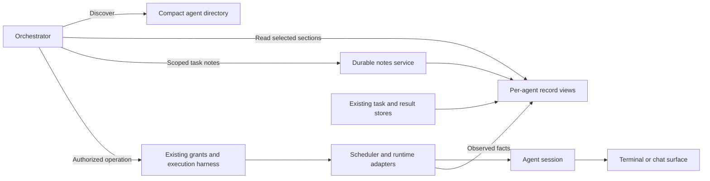

# Orchestrator agent harness overhaul plan

September 10, 2026.

**Scope narrowed after the user's instruction to avoid overbuilding.** The deep
dive and original roadmap below are retained as design background. They are not
a commitment to implement every phase. The current implementation is limited to:

- A stable agent record over the existing terminal/chat session directory.
- Project-aware automatic delegation and verified same-task continuation.
- Bounded, on-demand reads and small persisted Orchestrator notes.
- The reproduced Claude missing-ID child-approval repair.

The extra Agents screen, separate event journal, draft-reservation/close broker,
new request-control operations, and broader restart/lifecycle work are deferred.
The existing scheduler, provider adapters, terminal UI, delivery receipts,
permissions and result tracking remain the implementation owners. No new agent
framework or worker execution engine is introduced.

See [implementation progress](orchestrator-agent-harness-progress.md) for the
current acceptance gates, evidence and limits. Those scoped gates supersede the
original phase dependencies below. No release or installation has been performed.

## 1. Objective and boundaries

Make the agent session and its work the Orchestrator's primary operating concepts.
Each agent has an associated terminal or structured chat surface. Lina maintains
an indexed record for that agent, and the Orchestrator fetches the relevant parts
when needed. It does not need every agent's output, history, and notes in context
at once.

The harness must provide reliable identities; a compact searchable directory;
bounded reads of work, activity, notes, approvals and results; durable notes with
provenance; consistent operations through existing execution owners; and measured
acceptance with migration and rollback support.

This evolves the existing harness. Retain the terminal emulator, task scheduler,
provider adapters, independent-work routing, and uncertain-delivery protections.
Plain shells remain available. Fusion/Open Fusion remain one top-level agent with
inspectable participants and background work. Broad UI redesign, provider
replacement, new voice modes, unlimited autonomous work, and unrelated Git or
terminal-performance repairs are outside scope.

## 2. Baseline and evidence

The inspected HEAD was `810a866`, package version `0.1.115`. The working tree also
contains unrelated Git branch display work, including changes to `App.tsx`,
`types.ts`, `OrchestratorPanel.tsx`, and `package.json`. Those overlap future
integration points. Record the current state again before implementation; do not
reset, replace, or attribute those changes to this overhaul.

| Finding | Source and implication |
| --- | --- |
| `AgentSession` already exists but combines launch configuration, conversation references, activity, and geometry. | [frontend/types.ts](../frontend/types.ts). Add a distinct backend agent record; do not reinterpret the existing pane ID. |
| A shared directory combines native runtime, structured hosts, and paused panes. | [orchestratorIntegration.cjs](../backend/orchestratorIntegration.cjs), `createSessionDirectory`. Extend this boundary instead of building another observer. |
| Related work already uses verified conversation ownership, reservations, and scheduling. | [orchestratorRouting.cjs](../backend/orchestratorRouting.cjs), [orchestratorTasks.cjs](../backend/orchestratorTasks.cjs), and `prepareTaskAssignments` in [orchestrator.cjs](../backend/orchestrator.cjs). Retain these authorities. |
| Summaries omit detailed capabilities, tools, children, and approval reasons. | [orchestratorContext.cjs](../backend/orchestratorContext.cjs), `sessionSummary`. A native-shaped child-approval probe returned `waiting`, a completed root turn, and `readiness: ready`, without explaining the child. Separate idle-selection guards rejected it; this is not proof of unsafe dispatch. |
| Context is partly selective but still contains unrelated entries. | [orchestratorInterpreter.cjs](../backend/orchestratorInterpreter.cjs) already omits unaddressed IDs. Assignment initially includes up to 20 scoped sessions; execution includes up to 40 sessions in [orchestrator.cjs](../backend/orchestrator.cjs). Remove arbitrary samples while preserving useful omission rules. |
| Budgeting and recovery already exist with several operation allowlists. | [orchestratorBudget.cjs](../backend/orchestratorBudget.cjs), [orchestratorToolSchema.cjs](../backend/orchestratorToolSchema.cjs), [orchestratorReadRecovery.cjs](../backend/orchestratorReadRecovery.cjs). New reads need compaction, provenance, recovery, accounting, and progress integration. |
| Native/structured lifecycle parity is incomplete. | [orchestratorTargetAvailability.cjs](../backend/orchestratorTargetAvailability.cjs), [orchestratorCloseSafety.cjs](../backend/orchestratorCloseSafety.cjs). An idle Fusion-shaped session passed idle selection but failed inactive-close eligibility. Its directory entry omitted the executor model supplied at startup. |
| Restart has different conversation semantics. | `restartSession` in [App.tsx](../frontend/App.tsx): resumable native panes can resume; Fusion/Open Fusion restart fresh and retain the old conversation for deliberate resume. The new contract must express the choice. |
| Native child approval identity remains a gap. | [terminalRuntime.cjs](../backend/terminalRuntime.cjs), child `agent-running` handling. A missing-tool-ID approval disappeared after an unrelated tool return in the in-memory reproduction. |
| Request management and completion need separate concepts. | [orchestratorWorkspace.cjs](../backend/orchestratorWorkspace.cjs) declares request cancel/retry UI-only. [orchestratorTaskStatus.cjs](../backend/orchestratorTaskStatus.cjs) correctly separates delivery, observed turns, and independent verification. |

The earlier investigation passed **49 focused regressions** across status parity,
routing adapters, routing scheduling, task status, and close safety. That result
predates the implementation baseline; it is not full acceptance of this plan or
concurrent changes. Additional probes used synthetic state and production functions,
without operating user agents or running live models. Reproduce them as fixtures
in phase 0 instead of relying on the historical count.

Related work: [existing repair plan](orchestrator-repair-plan-2026-09-10.md),
[harness overhaul](orchestrator-harness-overhaul.md),
[capability audit](orchestrator-capability-audit-2026-09-10.md),
[performance overhaul](performance-orchestrator-overhaul-2026-09-10.md), and
[task ownership](orchestrator-task-ownership-review.md).

## 3. Required invariants

These are release blockers.

| ID | Invariant |
| --- | --- |
| I1 | Names, titles, recency, matching folders, and idle composers cannot establish task ownership. |
| I2 | An agent reference does not grant input authority. Effects retain exact current run, conversation, workspace, permission, and input checks. |
| I3 | A new/ambiguous conversation cannot inherit old pending inputs, approvals, completion evidence, or executable task authority. |
| I4 | Queued prompt, accepted transport, observed task start, response available, attributed turn end, and verified outcome remain distinct. |
| I5 | Unknown delivery is never automatically replayed after compaction, cancellation, retry, fallback, restart, or migration. |
| I6 | Current user constraints, literal prompts, explicit target groups, dependencies, and unresolved obligations survive context reduction. |
| I7 | Notes/retrieved text are reference data. They cannot create permissions, rewrite the objective, release dependencies, or manufacture completion. |
| I8 | Foreground completion cannot hide live children, pending approvals, unobserved work, or a human draft. Unknown counts/capabilities remain unknown. |
| I9 | Mounting, hiding, navigation, or renderer replacement cannot create a new run or prove work stopped. |
| I10 | Existing same-worktree coordination remains. More agents do not imply safe concurrent writes. |
| I11 | Persisted records restore history, never live grants, input leases, permission decisions, or queued sends automatically. |
| I12 | Query misses, clipped pages, unavailable history, and stale cursors are not evidence of absence. |
| I13 | Resource limits cannot silently evict unresolved delivery, ownership, approval, or stop evidence. Exhaustion is explicit. |
| I14 | Rollout never executes both paths or retries an uncertain new-path effect through the old path. |

## 4. Architecture and identity

### 4.1 Objects and owners

| Object | Meaning | Owner |
| --- | --- | --- |
| Agent record | One logical agent conversation/session, provisional while its initial native identity is established. | Backend directory and identity index. |
| Native conversation reference | Verified provider/store/workspace/root identity; composite participants can have separate references. | Existing metadata/host adapters. |
| Run reference | Execution attempt: surface/pane ID, backend generation, launch token. | Existing runtime or structured lifecycle owner. |
| Surface reference | Terminal/chat view; geometry and visibility are presentation information. | Frontend pane/workspace state. |
| Work item | Objective, constraints, requests, ownership evidence, dependencies, outcomes. | Existing work store, routing registry, scheduler, result stores. |
| Note | Finding, decision, open question, or handoff with source references. | Bounded notes service. |

An agent has its surface, while Lina retains process launch, observation, input,
and cleanup ownership. This relationship does not grant agents control over other
agents' terminals.

Introduce a distinct `agentId`; keep pane IDs and backend generations unchanged.
Do not use model names as identities. Preserve current provider/home/workspace/
native-ID checks, custom provider isolation, Open Fusion home isolation, Windows
path handling, junctions, and worktree identity. Distinguish launcher, engine,
configured model, and observed model. Missing observations stay unknown.

### 4.2 Identity transition contract

| Event | Behavior |
| --- | --- |
| New launch without a native ID | Create an explicitly provisional record tied to that launch. Preserve current initial-prompt admission rules; introducing `agentId` must neither weaken nor unnecessarily remove them. |
| First verified root | Bind once and check competing ownership. Reconcile historical identity through a checked transaction. Historical aliases are read references and cannot rewrite an in-flight grant. |
| Reattach/hide/rename/resize | Keep logical identity. Resizing may still invalidate native input evidence. |
| Restart/resume exact conversation | Reuse the logical record only after verification; create a new run binding with fresh action authority. |
| Explicit new conversation in same pane | Create a new agent record; archive the old association. Old tasks remain with their original conversation. |
| Unexpected native root change | Preserve runtime ambiguity and its restart/reverification requirement. A new agent ID cannot bypass it. |
| Resume conversation in another pane | Verify exact native/store/workspace identity and resolve competing live ownership before binding. |
| Close/remove project | Preserve bounded historical records. Only lifecycle reconciliation retires live ownership; UI absence is not stop proof. |
| Conflicting/unresolved restored mapping | Expose unresolved historical identity; never guess from names or timestamps. |

A stable agent reference improves retrieval. It does not make old run authority
stable. Test pending creation, first identity discovery, persisted duplicate
mappings, and resume into another pane as transactions, not label updates.

## 5. Record, retrieval, and context contract

### 5.1 Sections and truth sources

| Section | Contents | Source |
| --- | --- | --- |
| `identity` | Agent/native/run/surface references, project, composition, observation quality. | Identity and runtime/host adapters. |
| `work` | Work/request references, complete stored objective/constraints, queue/dependencies. | Work store and scheduler. |
| `activity` | Foreground state, tools, identified/coarse children, freshness. | Runtime/host reducers. |
| `attention` | Each pending root/child question or approval and its resolution identity. | Interaction/approval owners. |
| `capabilities` | Supported operations, current eligibility, limitations, configured/observed models. | Provider definitions plus current evidence. |
| `notes` | Findings, decisions, open questions, handoffs, author and evidence references. | Notes service. |
| `results` | Delivery receipts, attributed outcomes, output references, separate verification. | Existing delivery/completion/history owners. |
| `history` | Source references/cursors into events, notes, and native conversations. | Existing history adapters plus new indexes. |

Most sections are projections and references, not new copies of transcripts or
live state. Keep one source of truth for scheduling, approvals, dispatch, and
completion. Archived records must not retain PTYs, host objects, or output buffers.

The record belongs to Lina. Native agents receive selected task or handoff text
through the normal delivery path; writing a note does not send input or establish
that a worker knows its contents. Child/participant records explain activity and
supported pending interactions. They do not automatically become independent
terminal targets; new direct assignment to native subagents is outside version 1.

Replace ambiguous `ready` summaries with operation-specific information. Separate
process state, foreground activity, child work, attention, and input eligibility.
Support is `supported`/`unsupported`/`unknown`; current eligibility is
`eligible`/`blocked`/`unverified`, with source, reason, and revision. These fields
inform decisions but are not reusable authorization tokens.

### 5.2 Proposed tool operations

Freeze exact schemas in phase 1. They can remain operation kinds under the existing
`workspace` tool ABI; no second model/tool protocol is needed.

| Operation | Contract |
| --- | --- |
| `find_agents` | Filter by known project/work item, query, provider, activity/attention, archived scope. Return bounded page, coverage/totals, references and cursor. Top-level agents exclude shells and do not count children as independent agents. |
| `read_agent` | Read selected sections for one agent, with expected run where relevant. Return freshness and explicit unknown/unavailable fields. Profile reads do not open terminal output. |
| `read_agent_events` | Read typed changes since a cursor; expired coverage returns `history-gap` with a snapshot reference. |
| `read_agent_history` | Search/page the selected source through existing native/structured readers, preserving identity and paging guarantees. |
| `read_work_item` | Retrieve full constraints, dependencies, requests, and results when a summary is insufficient, including closed-agent work. |
| `record_agent_note` | Add/update a typed note with known agent/work/request scope, expected revision, evidence references, and idempotent note-operation ID. No arbitrary record patch. |

Register schema, read/effect classification, provenance, budget, compaction,
recovery, diagnostics, and progress behavior together. Prefer shared operation
descriptors over more divergent allowlists. Production planning and readiness
sizing must use the same active schema. Read metadata cannot mint effect grants.

### 5.3 Revisions, caching, and events

Responses identify their source/agent, applicable run, revision/time, coverage,
and cursor. Keep directory membership, meaningful agent state, and native input
authority revisions separate. Redraws and clock ticks cannot invalidate the whole
directory or masquerade as useful reasoning progress.

Page a stable membership order rather than a constantly changing activity order.
Membership changes return an explicit cursor restart without losing query scope.
Section reads can show newer state under the same membership page. Cache by
source/run/section/revision, label staleness, and revalidate delayed reads before
returning success. A prior run's content cannot become a current observation.

Build typed events from existing observers. Coalesce repetitive progress while
preserving approval, ownership, delivery, cancellation, failure, and result
transitions. Pending approvals and uncertain effects live outside the bounded
event ring; their correctness cannot depend on retention of their opening event.
Older detailed conversation text stays in its original provider/history store.

### 5.4 Default context and retrieval policy

Initially supply the current request, relevant exchange/continuation, protected
command scope/constraints/dependencies, unresolved effects, project reference,
compact counts, and a small set of relevant agent references. Relevant agents are
explicitly addressed targets, verified task owners, and necessary blockers. If
none are relevant, supply discovery tools and counts instead of an arbitrary sample.

Do not fill context with the first 20/40 sessions or unrelated work items. Resolve
explicit task/owner references before text search; query results alone are not
ownership proof. Cross-project questions can page broader records without loading
all transcripts or treating the first page as complete.

Keep large explicit target groups complete in application state with a frozen
group reference/count and pageable members. A short index cannot shrink a group.
Group preflight checks every intended member/condition before sibling effects,
then rechecks at each mutation. Until this new group contract is implemented and
tested, retain existing full target scope and reject an oversized envelope instead
of truncating it.

Compaction may retire retrieved bodies while preserving source bookmarks, useful
notes/references, instructions, receipts, and unfinished obligations. Omission is
not deletion at source, consumed task authority, or a reason to resend. Register
new read operations for whole-exchange retirement without orphaning tool results.

### 5.5 Starting limits for phase 0 measurement

These are proposed ceilings, not measured improvements or total limits on access
to source history. The stricter model-specific budget always wins.

| Item | Starting ceiling |
| --- | --- |
| Bootstrap discovery | At most 8 relevant index entries and 6 KiB serialized metadata; zero arbitrary entries. Protected authority/explicit groups are handled separately and cannot be dropped. |
| Directory page | At most 20 entries and 8 KiB; byte size can reduce the returned page with a valid cursor. |
| Detail/history body | Retain current 4,000-byte per-read and 12,000-byte per-round body budgets unless measurements justify smaller values. |
| Complete envelope | Preserve model-specific fitting, all schema/protocol fields, output reserve, and application ceiling. Count metadata as well as bodies. |
| Live event cache | Start at 128 events and 128 KiB per agent plus 8 MiB aggregate. Pending obligations are separate; eviction exposes a coverage gap. |
| Notes/index metadata | Start at 2 KiB per note body, 128 KiB per agent, and 8 MiB aggregate. Original objectives/native history stay in their owning stores. |

Bound descriptive text, never truncate an identity/path and use it as authority.
Use opaque references for long canonical identities. When pinned unresolved data
exceeds a cap, explicitly refuse additional bookkeeping or admission where
necessary; never discard obligations. Historical note expiry can initially follow
the work-item store's 30-day policy, with visible coverage and active-work
protection. Freeze final count/age/byte rules after fixture measurement.

### 5.6 Example request path

For "continue the authentication fix": resolve the relevant work item; read its
verified owner, current activity/attention, complete relevant constraints, and
short notes; fetch history only for a specific unresolved question; validate
continuity; compile the full instruction into the existing task operation; refresh
run/input/permission evidence at dispatch; retain the actual receipt and attributed
result; optionally record an evidence-linked note. No unrelated transcript is
needed and note persistence cannot declare the task finished.

## 6. Notes, persistence, and migration

Notes store concise findings and handoffs, not private model reasoning or copied
transcripts. Each note has identity, agent/work/request scope, kind, body, revision,
timestamps, author/source, and evidence references. Distinguish observed,
user-supplied, and inferred statements. Original constraints remain independently
protected in the task source.

The application stamps provenance from actual request and evidence records.
A model cannot label its own inference as a user instruction or native observation
by supplying an author/source field. Invalid references reject the claimed evidence;
a useful unsupported interpretation can only be retained as an explicitly inferred
note. Existing notes are not automatically injected into a worker's system prompt.

Only the notes service writes that schema. Concurrent edits use expected revisions;
conflicts return the current revision for reconciliation instead of silently
overwriting. Note-operation IDs deduplicate storage writes and are not terminal
action IDs. Deleting a note cannot delete results, grants, or native conversations.
Provide a documented UI path for inspecting and clearing stored notes.

Store new metadata under Electron userData, outside the repository and provider
homes. Reuse existing redaction before persistence and model delivery; redaction
failure refuses the affected write. Diagnostics carry bounded IDs/reasons/metrics,
not raw notes, prompts, screenshots, or transcripts. Provider-auth data is out of scope.

Use a versioned sidecar with one serialized writer and validated atomic replacement
or a recoverable journal. A durable-write receipt requires committed data; an
asynchronous error cannot follow a false "saved" response. Test interrupted writes,
unsupported schemas, corruption, disk-full, and clear-during-write. Preserve a
recoverable previous copy before migration; do not overwrite an unreadable store
just to make startup succeed.

New durability cannot rely solely on exit-time flush. The existing repair plan
documents shutdown races. Provide per-mutation commit and a tested awaited flush
for this owner. If the chosen design needs the general shutdown barrier, that
repair becomes a prerequisite; broad helper shutdown otherwise remains separate.

Migrate work/history additively through references. Preserve original records and
old schema readability. Restored live bindings require revalidation and restored
Orchestrator work stays paused. Do not change saved pane auto-start/resume preferences
or launch processes to populate the index. Missing/expired native history returns
unavailable coverage, not invented memory. Sidecar failure cannot remove existing
terminals or make a delivered prompt eligible for replay.

## 7. Semantic controls and required reliability repairs

| Intent | Meaning |
| --- | --- |
| Give an agent a task | Resolve/create the correct owner, bind the full objective, and submit through existing task/input adapters. |
| Continue work | Continue that work item/conversation with fresh request authority; busy input follows provider support. |
| Answer question/approval | Address the exact current interaction and permitted decision. A note or generic waiting flag cannot authorize approval. |
| Cancel queued work | Cancel selected proven-unsent work through the existing scheduler; preserve delivered work and in-flight uncertainty. |
| Stop work | Interrupt the authorized current run/turn and observe settlement, separately from cancelling request tracking. |
| Restart agent | Explicitly choose conversation preservation/resume or a new conversation. Unsupported/unverified preservation cannot silently become fresh work. Legacy UI behavior remains until its planned integration. |
| Close inactive agents | Apply one scoped policy to foreground, children, approvals, drafts, process/stop evidence across native and structured hosts. |
| Report result | Render application-owned status/evidence; label notes and agent claims separately from independent verification. |

Before new lifecycle/control effects are enabled, repair:

1. **Approval identity.** Retain pending approvals by generation, child/root,
   native tool/attempt and request identity. Correlate missing IDs only where
   native ordering establishes a unique candidate, never just by tool name.
   Cover duplicate/out-of-order hooks, same-name tools, unrelated returns,
   cancellation, termination, and replaced generations. Test actual generated
   Node and PowerShell payloads through the authenticated path.
2. **Shared lifecycle evidence.** Give structured composers revisioned dirty/pending
   and ownership state that survives unmount; directory metadata excludes draft
   text. Missing renderer evidence is unknown. Reserve/recheck at actual mutation,
   preserve drafts on failure, and retain the same conditions for close, restart,
   interruption, equivalent native exits, and project removal. Preserve existing
   observed-stop ownership and partial/uncertain receipts.

This covers the relevant parts of existing repair-plan package 2 and task controls
from package 3. Do not expand into arbitrary settings mutation. Agent capability,
status, and failure reporting should use package 1's fact/provenance approach;
general voice/settings factual-answer repair remains a separate scope.

## 8. Implementation phases and gates

All phases below are pending. Each is a reviewable change or small sequence of
changes. Do not combine identity, persistence, context replacement, and new effects
in one PR. Owners identify code responsibility, not extra agents or permission to
overwrite concurrent work.

| Phase | Deliverable | Depends on | Exit gate |
| --- | --- | --- | --- |
| 0 | Baseline fixtures, measurements, frozen contract decisions | This plan | Current behavior and known gaps reproducible; concurrent integration boundaries recorded. |
| 1 | Pure identity/projection contract | 0 | Identity transitions and source parity; dispatch unchanged. |
| 2 | Durable identity index and scoped notes | 1 | Crash, migration, concurrency, redaction, retention and downgrade tests. |
| 3 | Selective reads and bounded events | 1, 2 | Paging, provenance, recovery, budgets and targeted-source access. |
| 4 | Context assembler in comparison mode | 3 | Protected authority retained and context bounds measured, with no extra effects/model calls. |
| 5 | Approval ledger and shared lifecycle evidence | 1; coordinate with 2/3 | Native/structured approval, draft and lifecycle race matrix passes. |
| 6 | Agent planning and task controls | 4, 5 | Correct ownership, cancellation/retry, scope and no uncertain replay through full pipeline. |
| 7 | UI/voice integration and compatibility | 6 | Consistent presentation and intended pane behavior; default cutover still gated by phase 8. |
| 8 | Combined acceptance and staged rollout | 0-7 | Deterministic, model, native, packaged, migration, resource and rollback evidence recorded. |

### Phase 0: establish the baseline

Record commit/local diff and run the existing release baseline in a disposable
profile. Distinguish unrelated failures from overhaul regressions. Freeze
representative request/event traces before changing planners or projections.

Turn the summary/readiness, idle structured close, composition, child approval,
and initial-context findings into fixtures. Defect reproductions must be explicit
known-gap cases until repaired, not misleading passing feature acceptance.
Measure bytes by model stage, schema bytes, detail/transcript read counts, repeated
reads, updates, and retained registry memory for 1/20/200 mixed agents, including
long paths, hidden panes, child work and matches beyond one page.

Freeze identity/resume semantics and budget defaults in this document or a small
versioned contract amendment before implementation proceeds. Choose the sidecar
commit/recovery strategy in a disposable persistence spike; choose no database or
dependency solely because this is called an overhaul.

**Files:** existing `scripts/backend/orchestrator-*.test.cjs` and
`scripts/qa/orchestrator-performance-bench.cjs`; proposed
`scripts/backend/orchestrator-agent-contract.test.cjs` and
`scripts/qa/orchestrator-agent-context-bench.cjs`.

### Phase 1: pure agent identity/projection

Introduce versioned backend schema and pure projections over existing native,
structured, and task sources. Make composition and uncertainty explicit. Preserve
the legacy directory adapter. Map shells separately; frontend pane IDs keep their
meaning. No new polling loop, scheduler, or input path.

**Files:** proposed `shared/orchestratorAgentContract.cjs` and
`backend/orchestratorAgents.cjs`; existing `orchestratorIntegration.cjs`,
`orchestratorContext.cjs`, `orchestratorRouting.cjs`, provider capability data.

**Gate:** all section 4.2 transitions and source projections covered. Coarse or
unsupported providers never borrow stronger guarantees from another provider.
Projection of a known observer limitation is labeled; the projection cannot
claim to repair missing native evidence.

### Phase 2: persistence and notes

Implement one identity/notes sidecar owner per userData profile with section 6's
contract. Link work/results rather than duplicate them. Implement note retrieval
and clearing for later UI wiring. Model note mutations, when enabled, stay scoped
to the current request's known agent/work records; bookkeeping never authorizes
source-file changes.

**Files:** proposed `backend/orchestratorAgentStore.cjs`; integration with
`orchestratorWorkItems.cjs`, `orchestratorWork.cjs`,
`orchestratorConversationStore.cjs`, and disposal/flush where necessary.

**Gate:** interrupted write/reopen, duplicate mappings, migration repeated twice,
unsupported schema, missing source history, stale note revision, disk-full,
clear-during-write and retention tests. Restoring notes cannot dispatch, release
dependencies, or attach to another provider home.

### Phase 3: selective retrieval

Implement sectioned reads, work-item lookup, directory cursors, bounded events,
source history references and note-operation schema. Listing/filtering metadata
must not open every native transcript or serialize terminal buffers. Terminal and
history detail still pass through their existing adapters.

**Files:** proposed `backend/orchestratorAgentQueries.cjs` and shared operation
descriptors; `orchestratorWorkspaceExecutor.cjs`, `orchestratorToolSchema.cjs`,
`orchestratorRoutePlanner.cjs`, `orchestratorReadRecovery.cjs`,
`orchestratorBudget.cjs`, history adapters, `orchestratorDiagnostics.cjs`.

**Gate:** source-read spies prove selection. Every operation participates in
budgeting, protocol, provenance, recovery and classification. Stale cursors cannot
skip records; unknown source/run references cannot return success for another source.

### Phase 4: context assembly in comparison mode

Build one task-aware context assembler for interpretation, routing, execution,
readiness sizing and continuation. Remove arbitrary samples only in the new path.
Protect addressed targets, verified owners, blockers, complete instructions and
pending uncertain effects.

**Files:** proposed `backend/orchestratorAgentContext.cjs`;
`orchestratorInterpreter.cjs`, `orchestrator.cjs`, `orchestratorReplyContext.cjs`,
`orchestratorContinuation.cjs`, `orchestratorBudget.cjs`,
`orchestratorExecutionHarness.cjs`.

Comparison mode computes old/new projections from the same retained state. It
does not dispatch twice, call another paid model, or read all transcripts to
compare them. Offline replay checks semantic coverage rather than identical text.
Freeze one harness version per request/retry; global switches apply at safe new
request boundaries.

**Gate:** default discovery bytes plateau as irrelevant agents grow; targeted work
reads no unrelated transcript; broad queries stay complete; compaction retains
instructions and receipts. New live planning/control adoption waits for phase 5
and combined acceptance.

### Phase 5: approval and lifecycle repair

Implement section 7's two prerequisites. Fix event identity and ownership before
exposing derived eligibility. Use one shared preflight; do not create another
inactivity predicate for each agent tool. Equivalent operations must preserve
the original condition and target set.

**Files:** `agentTelemetry.cjs`, `terminalRuntime.cjs`, `claudeTaskTelemetry.cjs`,
structured hosts/panes, `orchestratorIntegration.cjs`,
`orchestratorCloseSafety.cjs`, `orchestratorTargetAvailability.cjs`,
`orchestratorLaunchers.cjs`, `orchestratorIntent.cjs`,
`orchestratorWorkspaceExecutor.cjs`, `observedStop.cjs`, close/project controllers.

**Gate:** missing IDs, simultaneous approvals, stale generations, child termination,
unmounted composers, draft races, partial close, interrupted restart, delayed stop
proof and mixed groups pass through actual adapter boundaries. Unconditional
closure remains available in its own scope, never a substitute for conditional cleanup.

### Phase 6: agent planning and task controls

Expose narrow agent task/inspection and request discovery/cancel/retry schemas.
Compile them into existing grants and adapters. Make preserved versus new
conversation explicit; retain native menu inspection when no structured source
exists. Preserve the existing semantic boundary between independent work and
continuation, including work the user started manually.

**Files:** `orchestratorPlannerPrompt.cjs`, `orchestratorPlannerTools.cjs`,
`orchestratorInterpretationSchema.cjs`, `orchestratorIntent.cjs`,
`orchestratorRouting.cjs`, `orchestratorTasks.cjs`, `orchestratorContinuation.cjs`,
`orchestratorWorkspaceExecutor.cjs`, request/result projections and integration.

**Gate:** named agents, unchosen provider/project, new independent work, busy
continuation, queued cancel, unknown delivery, retry, review-only tasks,
multi-target work and worktree dependencies pass request-to-receipt tests.
Application-owned status facts cannot be overwritten by notes or unsupported
model prose. A supported reply does not falsely imply verified implementation.

### Phase 7: UI, voice, compatibility

Distinguish agents from shells, root work from children, and task progress from
process state. Reuse existing task details/history to expose agent sections,
notes, provenance and missing evidence. Keep direct terminal/chat access and
manual input. Model, UI and speech consume the same backend projection.

**Files:** `frontend/types.ts`, `App.tsx`, `electron.d.ts`, `preload/preload.cjs`,
Orchestrator panel/dashboard/work-history components, `terminalRuntime.ts`,
`orchestratorState.ts`, session persistence and task speech/interaction paths.
Integrate concurrent frontend changes without replacing them.

Retain saved pane/setup/history readers and legacy pending-grant decoders.
Existing requests complete under their original version. Advertise new operations
only where supported; unsupported providers retain explicit limitations and their
normal terminal access.

**Gate:** native/structured UI and voice parity, agent navigation, note inspection/
clear, paused restoration, large directories, multiple questions, background work,
and draft preservation. Restored notes/inventory cannot start work automatically.

### Phase 8: combined acceptance and rollout

Run section 9's matrix. Record commit, artifacts, environment, provider versions,
model identifiers, cost and exact acceptance boundaries. Verify disposable
packaged profiles, representative old saved data, interrupted updates and rollback.
A source pass is not installation evidence.

Order: isolated fixtures; read-only comparison; opt-in new retrieval/planning;
bounded native/provider acceptance; default enablement after gates. Keep unsupported
native capabilities limited. Remove replaced code only after caller/persistence
audits show it is no longer needed. Preserve sidecar data on rollback; disable its
use rather than delete user notes. Publication/installation is a separate release task.

## 9. Verification matrix and measurements

| Area | Cases | Pass condition |
| --- | --- | --- |
| Identity | Rename/remount/resize, restart/resume, new chat, ambiguous root, different homes, competing panes, absent initial root. | Correct record/run attribution; no old authority, approval or completion transferred. |
| Retrieval | 1/20/200 agents, match past page one, long paths/names, hidden/archived agents, churn, stale cursor, event gap, missing history. | Complete declared coverage or explicit limitation; scoped queries read no unrelated transcripts. |
| Context | Small budget, large literal prompt, long paging, older reply, many siblings, full group, irrelevant output flood. | Protected authority/task meaning retained; bounded metadata and correct bookmarks/truncation. |
| Notes | Concurrent updates, stale revision, injection-like text, wrong evidence source, runtime-field patch, repeated ID, clear while writing. | Scoped reference data, no authority escalation, deterministic persistence outcome. |
| Approval/activity | Completed root with live child, simultaneous/missing-ID approvals, unrelated return, stale hook, child exit, lost telemetry. | No premature clearance/completion; uncertainty remains explicit. |
| Input | Draft/typing during read or dispatch, busy/queued input, partial write, timeout, cancel, changed run/root. | No duplicate send/overwrite; existing fences and truthful receipt boundaries. |
| Lifecycle | Conditional/unconditional close, mixed group, unmounted draft, preservation/new restart, removal, partial/unknown stop. | Original scope/conditions preserved; no false stopped or preserved-conversation claim. |
| Scheduling | Same task busy, independent same worktree, linked worktree, path alias, dependency, failed/uncertain/restored task. | Existing ordering and ownership; unrelated completion cannot satisfy a wait. |
| Persistence | Crash at each commit point, corrupt/unknown schema, repeated migration, disk-full, downgrade, archived and pinned active data. | Acknowledged data recoverable; no automatic authority restoration/history loss. |
| Resources | Output flood, hidden agents, repeated create/close, retention, many notes/approvals. | Bounded caches; no transcript duplication or per-output model calls; no retained PTY/host buffers. |
| Model behavior | Paraphrases/typos, ambiguous names, topic changes, many matches, misleading notes, compound tasks, unsupported capabilities. | Correct target/intent, factual status and complete work; evaluate separately from tool-call validity. |
| Product | Native, Fusion, Open Fusion, shells, voice/text, old panes/setups, packaged upgrade/rollback. | Consistent supported behavior and explicit limits without regressing manual use. |

Measure serialized bytes separately for instructions/authority, tools, bootstrap,
retrieved bodies, and retained receipts. Record source reads, repeated reads,
model rounds/tool calls, time to useful action, and task accuracy. With 20 versus
200 irrelevant agents, discovery stays within its cap and targeted requests add
zero unrelated transcript reads. Byte savings alone do not prove latency/cost
gains; compare distributions under the same model/settings.

Use deterministic byte/read-count assertions in CI. Measure timing/memory on
controlled fixtures and investigate material regressions instead of imposing
fragile universal millisecond thresholds. Compare retained heap/buffers after
matching create/close cycles against the existing retirement benchmark.

Run affected existing suites at each phase. Combined acceptance includes
`npm run check:orchestrator`, `npm run test:terminal-status`, and applicable
standalone/structured adapter checks. Wire new tests and benchmarks into real
release commands. Reuse native-root ambiguity, routing, budget, unknown-delivery,
close, session-resume and performance fixtures instead of bypassing them.

Live model evaluation uses held-out requests with identical synthetic inventory
and provider evidence for old/new paths. Include at least 30 distinct scenarios
with multiple phrasings, repeating nondeterministic cases; report failures/counts,
not a universal reliability percentage. Any wrong-owner effect, permission
expansion or uncertain replay blocks rollout. Separate unsupported/bounded outcomes
from successful completion. Mock tool-call passes do not establish model judgment.

Native acceptance uses disposable projects/profiles with standalone Codex, Claude,
Fusion and Open Fusion, plus coarse/unavailable-provider fixtures. Record current
installed versions and limits. Never send acceptance tasks to the user's working
conversations. Set model spend/runtime ceilings when scheduling those tests; no
paid calls or native worker launches are part of writing this plan.

## 10. Rollback, dependencies, and stop conditions

Freeze one version per request, including retries/deferred work. Mode changes
affect new admissions only. Unfinished legacy work retains its decoder, original
scope and receipts; restored work remains paused. Emergency disablement stops
new admissions and keeps dispatched/uncertain work tracked through reconciliation.

Rehearse rollback with running, queued, ambiguous, waiting-approval and restored
requests. Preserve sidecar data, outstanding receipts and stop evidence while
returning new requests to the old path. Source-matched read fallback can recover
a read; uncertain effects cannot fall back to another agent/pane/harness.

| Existing repair scope | Relationship |
| --- | --- |
| Package 1: factual answers/error evidence | Reuse fact/provenance rules for agent capability/status/failure facts; broader voice/settings answers stay separate. |
| Package 2: approval/lifecycle | Required before new agent control effects; phase 5, one shared owner. |
| Package 3: request/settings controls | Include request discovery/cancel/retry in phase 6; arbitrary settings mutation deferred. |
| Package 4: shutdown | Commit new metadata during operation with tested flush; broad helper shutdown separate unless the persistence design depends on it. |
| Packages 5/6: transport/history bounds | Preserve retirement/observation gains and avoid copying buffers; broad backpressure/virtualization separate. |
| Package 7/concurrent Git work | Separate scope; reconcile overlapping frontend/package files. |
| Package 8: acceptance | Extend existing infrastructure and separate source, synthetic, live, packaged, and installed claims. |

Stop advancing when identity parity fails, an obligation can be evicted, migration
cannot be rolled back, an action bypasses checks, context loses constraints/targets,
source reads scale with unrelated transcripts, or live/factual claims lack adequate
evidence. Repair the failed contract; do not weaken guards or use unverified effects
as a fallback.

| Principal risk | Governing invariants | Required gate |
| --- | --- | --- |
| Task reaches another conversation after restart, migration or alias resolution | I1-I3 | Phase 1 identity transitions, phase 6 full-pipeline ownership, phase 8 native resume. |
| Context reduction loses a constraint or a member of a requested group | I6, I12 | Phases 3/4 pagination, protected-context and large-group fixtures. |
| Stored note becomes authority or a false result | I4, I7, I11 | Phase 2 provenance, phase 6 fact-based reporting, restore and hostile-note cases. |
| Child approval or draft disappears before cleanup | I8, I9 | Phase 5 generated-hook and native/structured composer races. |
| Recovery or rollback duplicates a delivered task | I5, I14 | Phase 6 cancellation/retry and phase 8 in-flight rollback rehearsals. |
| Agent records recreate the memory/copying problems of full inventories | I10, I13 | Phases 3/4 resource/read-count measurements and phase 8 retirement acceptance. |

## 11. Original completion proposal (superseded by the scoped delivery above)

The original broad roadmap proposed completion when every phase gate and required matrix case passes,
the new path is the documented default for supported operations, compatibility
and rollback are verified, and context/resource measurements are recorded.
Calendar estimates follow baseline and identity/persistence spikes; progress is
measured by gates and unresolved risks, not renamed-file counts.

The first implementation slice is:

1. Capture the baseline and convert the investigation probes into fixtures.
2. Define the pure agent projection and identity-transition contract.
3. Compare its output with existing directory/runtime/task evidence in tests and
   read-only comparison, leaving production planning/dispatch behavior unchanged.

That proves the record can represent current behavior truthfully. Persistence,
retrieval, context cutover, and new controls follow their dependencies above.
