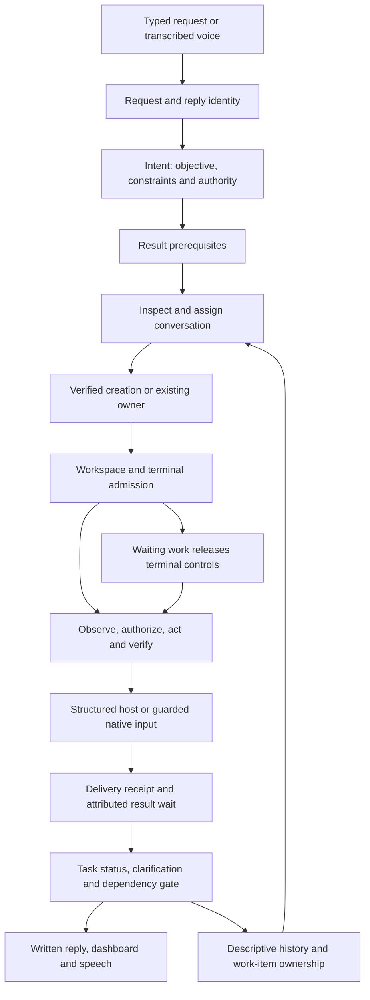

# Orchestrator cohesion review

Consolidated September 8, 2026, from three audits and a review of subsequent
Grok, terminal-status and session-resume changes, based on v0.1.101 (`08f467f`).
This is the current review and repair record. The existing
routing, task, voice and renderer work was preserved; the audits focused on
connecting their contracts and testing real producer/consumer handoffs.

The first two passes repaired eight and ten integration gaps respectively.
The third pass revisited alternate input forms, mixed requests, history
retention, asynchronous host actions and native identity provenance. Findings
from all three passes are grouped below, including corrections to earlier
fixtures that were more complete than production metadata. The preceding review
compared the previous verified manifest with 55 new or changed files and
preserved the new provider, status and persistence features.

## Repeated review and repair (September 8, 2026)

At the user's request, the second working-tree review repeated reproduction,
repair and fresh review across the combined changes. Reviewers changed areas
between passes; parent checks exercised the actual IPC and event consumers as
well as helpers. The previous acceptance manifest was unchanged when this
review began.

| Reproduced problem | Repair and regression boundary |
|---|---|
| A stopped/superseded chat launch could finish preparation and start later; concurrent preparations could overwrite per-pane files. | `chatLaunchPreparation.cjs` serializes preparation and cleanup per pane, retires obsolete work before host dispatch, and cancels pending launches on shutdown. Independent panes remain concurrent. Actual main IPC handlers are exercised. |
| Live Open Fusion Brain changes broke generation ownership after remount; genuinely changed starts attached to the old host generation. | Live Brain selection retains ownership; a new generation replaces the previous host child and fences old callbacks. |
| Spawn error followed by `close` without `exit`, or failed Codex initialization, left an unusable child that retries reattached. | Retire the failed child and announce closure so a retry launches again. |
| Input during Open Fusion resume lookup could create a fresh root before the saved root arrived. | Root creation/submission waits for resume resolution and revalidates the current host afterward. |
| Fusion clean-exit recovery lost the native resume ID and was rejected by the installed integration's paused-inventory filter. | Preserve authoritative native identity; only the retained owner's explicit restart can cross that display boundary. Stop/replacement revoke recovery. Old completion evidence stays separate from the new turn. |
| Numeric generation `0` was dropped across delivery, queued cancellation, creation continuity, monitoring and reads. | Nullish/exact-presence checks preserve identity; old-generation interactions and replacement panes cannot bypass the read fence. |
| Readiness watches completed from idle metadata before process/input readiness. | Pending launch, unknown/non-running process state and explicit engine-not-ready evidence block readiness. Startup failure remains failure; shell and legacy optional-field semantics are retained. |
| A delayed start with a previously unseen native turn ID rewound newer activity. | Root start timestamps are checked against the current turn, its end and pending input. Equal timestamps remain valid. |
| Grok session creation/relocation with incomplete summaries or cwd markers could establish false uniqueness. | Incomplete metadata retains uncertainty; duplicate native identities are checked before accepting summary content and before reading history. |
| JavaScript normalized impossible Grok dates that the native parser rejected. | Validate calendar days and hours; native Grok 1.0.13 fixtures verify rejection, with valid leap-day/timezone regressions. |
| Cancelled or interrupted speech could hold the queue behind a never-settling credential/fetch promise. | Each speech execution has cancellation settlement independent of the provider promise, with late-result and capture fences. |
| Error announcements lost cancellation ownership while subsequent speech advanced. | Preserve both the speech execution epoch and original request ID through local error playback. Missing-key/TTS-error cases cover request, signal, push-to-talk and global cancellation plus late acknowledgments. |

The main-process lifecycle regression is included in `test:orchestrator` and
`check:orchestrator`. The additional native Grok test validates required fields
and invalid timestamps without running a model turn.

The final fresh review found no further reproducible defects. It covered
production chat event/IPC composition, numeric generation and readiness
consumers, cancellation during both missing-key and TTS-error audio, and
Grok marker/enumeration/duplicate/history combinations. Unknown-cwd folders
contribute possible duplicate IDs; failed or truncated enumeration cannot
certify uniqueness. Known foreign folders and unrelated enumerated IDs remain
isolated. Final acceptance below was run after these repairs.

## First working-tree review (September 8, 2026)

The follow-up reviewed all current uncommitted changes against `08f467f`,
including new modules, renderer changes, provider adapters, tests and QA scripts.
The initial combined acceptance command passed, but boundary review reproduced
eight additional defects. Each repair has a behavioral regression check.

| Reproduced problem | Repair |
|---|---|
| Routed native controls could cross a conversation switch during an asynchronous screen read. | Check the assigned native identity before observation and immediately before writing. |
| Startup captured the previous launch's generation or exited state while inventory caught up. | Wait for the acknowledged launch token before using its generation or failure evidence. |
| Remounting Fusion/Open Fusion with its newly discovered resume ID minted a different directory generation from the still-running host. | Preserve ownership, readiness and pending interactions when the remaining configuration and authoritative conversation ID match. Different IDs/configurations remain fenced. |
| Numeric generation `0` disappeared during task tracking and falsely failed a valid task. | Preserve zero with nullish generation handling, including repeated delivery updates. |
| Retained provisional/unavailable child approvals displaced live child or root attention. | Use the same verified child selector for displayed status and attention acknowledgement. |
| Delayed tool callbacks acknowledged a newer prompt or revived a settled response. | Preserve callback phase and fence both activity and running events against prior turns, submission timestamps and settlement. |
| A question answered/replaced during credential lookup could still start obsolete speech. | Revalidate cancellation and current task/native question identity after the asynchronous lookup. |
| Status requests crashed after the original terminal closed, or borrowed a replacement pane's metadata. | Keep frozen request generation and original name/folder when the matching live pane is absent; never resubmit input. |

QA repairs also updated the provider-registry assertion for Grok and included
metadata discovery in `check:orchestrator`; removed dependence on Codex's rotating
composer placeholder; and made dashboard geometry checks wait for stable rendered
frames instead of sampling an unfinished width transition. Existing transport,
layout and animation assertions remain intact.

## Preceding-change findings

| Reproduced problem | Repair |
|---|---|
| A successful root result released dependent work while detached children still ran. | Result waits and native completion capture require child work to settle. A root result remains distinct from the task's complete result boundary. |
| A failed/interrupted root released workspace ownership despite surviving child edits. | A shared occupancy predicate retains known background work independently of task success/failure, including cancellation, history clearing, capacity and affinity. Last-child settlement releases the lease without turning failure into success. |
| Resolving a structured permission made readiness watches finish while the turn remained active. | Readiness and ordinary input admission respect `turnActive`; the new display semantics and intentional operator steering remain intact. |
| Duplicate provisional idle events erased a newer submission intent. | Duplicate/stale response handling precedes clearing input, preserving the newer request until genuine activity is observed. |
| Provisional child Stop events erased lifetime proof; delayed older stops could hide newer activity. | Provisional proof is retained separately from observed activity, with activity timestamps fencing older stops. Matching authoritative Codex child completion or explicit lifetime-end evidence can settle it. UI and directory show unverified activity without inventing active child counts. |
| A nested Kimi Agent-tool return could erase its issuing native child. | Fallback brackets use the actual tool ID in a separate namespace, or coarse evidence when absent. They cannot replace native child ownership. |
| Fusion never emitted the readiness signal its launcher required. | Claude Fusion signals writable current-process input readiness; Codex Fusion waits for RPC initialization. Failures and stale starts do not announce readiness. |
| Resumed OpenFusion history looked like new running work and skipped engine readiness. | Restored content remains visible as replay, without creating live work or interactions. Successful restoration announces readiness. |
| Grok's explicit SessionEnd lost its definitive lifetime meaning in shared child-stop handling. | It retains session-end identity through telemetry; provisional Stop remains separate from real lifetime end. |

The Grok discovery/launch/history audit found no independent defect in those
paths. Installed 1.0.13 inspection and native session-parser checks passed.
Frontend current-thread persistence and launch-token confirmation also passed;
the restoration repairs above were in the backend host producers.

## Connected lifecycle

A request owns the user's exchange and execution lifecycle. A work item connects
related requests to an objective and native conversation. A pane/generation
identifies a live endpoint; its native provider/home/project/conversation identity
identifies the conversation. An action ID identifies input delivery. A turn ID
identifies observed agent work. None of these records substitutes for another.

## Repairs across all three passes

### Assignment and terminal delivery

| Problem | Current behavior |
|---|---|
| Real automatic creation omitted process state required by its downstream binder. | Readiness supplies observed process state, directory and name, discarding provisional metadata. The full adapter-to-binder-to-submission regression consumes real adapter output. Creation alone never starts a result wait. |
| Bundled Kimi + CC was absent from PATH probes and therefore unavailable to automatic routing. | The existing bundle resolver supplies an actual entrypoint check. Missing bundles remain unavailable. |
| Explicitly targeted queued prompts lacked automatic routing's native conversation fence. | All managed sends carry the original binding as post-claim adapter metadata. Queued delivery cannot migrate to another known conversation. Shell input retains its existing transport semantics. |
| Fusion could cross conversations after awaiting asynchronous telemetry steering. | The host boundary rechecks native identity after the await. An earlier possibly applied steering effect remains uncertain; it cannot trigger fallback delivery to a replacement. |
| Structured native session events lagged behind UI inventory, retaining stale identity and turn evidence. | Current-generation host session IDs take precedence. Known switches retire current turn/action fields while preserving historical result cache and transcript content. Initial and matching resume events are idempotent. |
| Questions from an old structured conversation could block new work or reach the wrong host context. | Confirmed switches retire the old pending question revisions and their voice contexts. GUI and model answers recheck current question revision and conversation binding at dispatch. |
| Parentless native root events could silently leave an old root looking current after a supported native `/new`. | Conflicting authenticated root evidence is treated as ambiguous, without adopting an unproven replacement. Current recipient/completion proof is invalidated; a fresh generation restores normal observation. Proven child events retain their separate handling. See the native-identity boundary below. |

Primary owners: `orchestratorIntegration.cjs`, `orchestratorLaunchers.cjs`,
`orchestratorDelivery.cjs`, `orchestratorTerminalInput.cjs`,
`terminalRuntime.cjs`, `cliProbe.cjs` and `main.cjs`.

### Submission, scheduling and result attribution

| Problem | Current behavior |
|---|---|
| Mouse task submissions were tracked as result waits but omitted from work-item ownership; accepted Enter aliases also passed through separate predicates. | One submission classifier drives ownership, scheduling and result tracking. It covers submit, normalized Enter/Ctrl-M/Ctrl-J and task-purpose mouse click/up. Interaction-only controls do not acquire task ownership. |
| Dependent automatic requests opened workers before prerequisite results existed. | A dependency-only gate validates the exact successful result before routing or creation, while releasing the serialized interpretation lane. |
| Two independent mutations in one request bypassed workspace serialization. Mixed explicit/automatic targets also behaved differently depending on order. | Submission admission compares current or prospective canonical workspace ownership for both forms. Independent mutations wait; read-only work and separate workspaces remain independent. No speculative grant, reservation or work-item ownership is minted while checking admission. |
| Waiting for a sibling task could prevent answers or compatible continuations from reaching its running agent. | Parked requests retain workspace ownership and release terminal control lanes. Resumed submissions reacquire admission and revalidate their original observation; stale tokens require another read. |
| A fast agent failure could be marked finished when the response loop finalized later. | Finalization honors failed waits. Dependency reads reject failed, missing, restored-only or unattributable results. A successful transport receipt does not certify successful agent work. |
| Transferring a clarification marked its original request finished while previously submitted work still ran. | Consuming a question transfers unfinished control authority while preserving the original result waits and failures. Dependent work waits for the native result. |
| A new native conversation in the same pane/generation could complete an earlier task. | Submission and watch waits retain native identity. Known replacements fail the old wait; missing identity stays uncertain; new workers can latch their first observed native ID. Historical completion is not relabelled as the pane's current conversation. |

Primary owners: `orchestrator.cjs`, `orchestratorTasks.cjs`,
`orchestratorSubmission.cjs`, `orchestratorRouting.cjs`,
`orchestratorTaskStatus.cjs` and `orchestratorFinalResponse.cjs`.

### Continuity, history and context

| Problem | Current behavior |
|---|---|
| Explicit submissions never updated persistent work-item status/summary because they had no automatic reservation. Completed tasks also retained obsolete waiting text. | Work-item projection follows live request owners independently of reservations. Completion clears stale waiting reasons; later activity replaces finished descriptions without hiding older outstanding work. Unchanged refreshes do not rewrite history. |
| Clearing history or capacity eviction could delete an original operation scope still needed by a multi-question continuation. | Live operation-source references are retained transitively. Completion/cancellation releases their protection; persisted history cannot recreate executable authority. |
| Clearing history could remove an already successful prerequisite while its dependent request waited for another workspace. | Live dependency references share the retention policy used by clear and capacity eviction. Completed or abandoned chains do not permanently pin old history. |
| Clearing history removed explicit active work-item affinity while retaining its running task. | Active explicit submissions and inherited clarification work-item references survive clearing; unreferenced finished affinity can be removed. |
| A plain status lookup without a previous submitted request could dereference an absent reply reference. | The compiler guards the optional reference; ordinary status lookup works without prior submission. |
| An unrelated successful read could erase an expired conversation read failure. Real History planner metadata then prevented valid same-source recovery. | Recovery requires the same opaque source or application-owned native identity. Planner family is relevant only to Fusion. Actual directory and History output are tested across eleven launcher kinds and both Fusion planner families. Unknown replacements and true source/home/profile/family changes remain rejected. |

Primary owners: `orchestratorIntent.cjs`, `orchestratorReadRecovery.cjs`,
`orchestratorReplyContext.cjs`, `orchestratorConversationStore.cjs`,
`orchestratorWorkItems.cjs` and `orchestratorTasks.cjs`.
Existing bounded context, paginated source reads and consumed action authority
remain part of the tested contract.

### Cancellation and voice

| Problem | Current behavior |
|---|---|
| Cancellation during asynchronous workspace resolution restored stale continuity and changed cancelled status. | Cancellation is checked immediately after resolution, before lane, target or task mutations. |
| A late detached creation acknowledgment could mutate persistence after disposal had flushed. | Disposed-only fences stop late publication and binding. Live cancelled requests can still retain truthful acknowledgments of effects already dispatched. |
| Cancelling a duplicate task announcement waited for another request's playback. | Duplicate waits settle on their own abort signal without interrupting the owner's playback. |
| Typed answers, cancellation or removed task questions left an obsolete voice answer window that discarded the next spoken command. | Task-state reconciliation and PTT start retire stale question context. Audio captured for the old question is cancelled, never converted into a fresh command. |
| The mic's stop button cancelled unrelated Orchestrator requests while stopping transcription/thinking. | “Stop current voice turn” cancels voice capture/STT/speech only. Global task cancellation remains an explicit workspace control. |

Primary owners: `orchestrator.cjs`, `orchestratorTaskSpeech.cjs`,
`voiceController.cjs`, `orchestratorIntegration.cjs` and
`frontend/VoiceIndicator.tsx`. Written replies and spoken summaries stay
separate; complete question wording and answer identity are preserved.

## Repeatable acceptance

Run `npm run check:orchestrator`. The combined check includes backend/voice,
Grok, status and host-readiness regressions, telemetry and host-parser smokes,
the production typecheck/build, renderer/persistence checks, voice capture and
mic-stop checks, and hidden Electron/preload/PTY, task-UI and two-process
session-resume smokes.

Latest repeated-review acceptance passed: **1,447 backend tests and 17 frontend
tests**, with no failures or skips. `npm run check:orchestrator` passed the
production typecheck/build, all included smokes and two-process restoration
of 26 panes. The expanded installed Grok parser check, hidden background launch
workflow and local-model voice wake/interruption checks also passed.

Latest evidence:

- `.tmp/review2-20260908/accepted-check.log`: final combined acceptance after all repairs.
- `.tmp/review2-20260908/source-hashes.json`: final changed-file manifest.
- `.tmp/review2-20260908/grok-native-accepted.log`: installed Grok 1.0.13 parser parity.
- `.tmp/review2-20260908/voice-wake-accepted.log`: synthetic audio through local keyword/VAD/turn models, with cloud audio mocked.
- `.tmp/review2-20260908/background.log`: real hidden Electron/PTY creation, remount and restart checks.
- `.tmp/session-resume-smoke/1788881710738-23516/`: final two-process restore records; provider starts/lookups are fixtures.

Full dashboard motion acceptance remains unverified under hidden Electron's
limited compositor cadence, as recorded in the prior run below. Live model
quality, physical microphone acoustics and the installed release were not tested.

The first working-tree acceptance passed **1,365 backend tests and 17 frontend tests**,
with no failures or skips. All checks in the expanded command passed, including
metadata discovery and two clean Electron processes restoring 26 panes.
Separate discovery/setup/attention smokes, hidden command/background-launch
workflows, installed Grok 1.0.13 history parsing, four bundled Codex 0.144.0 native
submission cases, and local-model voice wake interruption also passed. The native
submission server returned only local fixture errors, with no model output;
cleanup confirmed the native PID exited despite a node-pty console-helper warning.
No paid model turn was run.

First working-tree evidence:

- `.tmp/review-20260908/final-acceptance.log`: complete expanded acceptance.
- `.tmp/review-20260908/source-hashes.json`: final changed-file manifest.
- `.tmp/review-20260908/background.log` and `command.log`: hidden Electron/PTY workflows.
- `.tmp/review-20260908/native-submission-final.log`: native raw/bracketed input and operator controls; one submission Enter and one local request per case.
- `.tmp/review-20260908/voice-wake.log`: local keyword/VAD/turn models interrupting preparation and playback with synthetic audio.
- `.tmp/review-20260908/dashboard-final.log`: layout, mounted nodes, launch generation, persisted layout, labels and PTY-size checks pass; full motion acceptance is **unverified** because hidden Electron supplied four frames in four seconds, below the unchanged 30-frame requirement. Static screenshot inspection passed. Foreground compositor timing remains a separate check.
- `.tmp/session-resume-smoke/1788879805944-16944/`: current two-process persistence/IPC records for 26 panes; provider starts/lookups remain fixtures.

The preceding acceptance passed **1,351 backend tests and 17 frontend tests**:

- `.tmp/harness-latest-changes-20260908/combined-check.log`: complete check.
- `.tmp/harness-latest-changes-20260908/source-hashes.json`: final source manifest.
- `.tmp/harness-latest-changes-20260908/grok-native.log`: installed native parser check.
- `.tmp/session-resume-smoke/1788866331638-54348/`: separate seed/reopen process
  records; provider starts/lookups are fixtures, persistence and IPC are real.
- `.tmp/orchestrator-smoke/1788866329198-54112/results.json` and
  `.tmp/orchestrator-task-ui-smoke/1788866330663-48056/results.json`: current
  Electron/PTY and task-UI evidence.

Historical third-pass parent acceptance passed: **1,241 backend/voice/launcher tests and
two mic-stop composition tests**, with no failures or skips. Terminal-runtime
and generation-telemetry smokes, production typecheck/build, six renderer smokes,
capture/hold checks and both hidden Electron workflows passed. The build retains
its bundle-size advisory. `git diff --check` and report links also passed.

Third-pass evidence:

- `.tmp/harness-third-pass-20260908/combined-check.log`: complete parent check.
- `.tmp/harness-third-pass-20260908/source-hashes.json`: final working-tree
  hashes and base revision.
- `.tmp/orchestrator-smoke/1788860582634-58628/results.json`: real hidden
  Electron/preload, native history helper and PowerShell transport.
- `.tmp/orchestrator-task-ui-smoke/1788860585345-53740/results.json`: wide/narrow
  task layout and request/reply association through IPC.

Regression fixtures preserve real source identity and adapter receipt shapes.
Persistence checks observe successful atomic commits and compare disk after the
production flush; they do not infer persistence from arbitrary delays.

Historical runs remain available:

- First pass: 1,125 tests plus build/UI/Electron checks;
  `.tmp/harness-cohesion-20260907/combined-check.log`.
- Second pass: 1,189 tests plus build/UI/Electron checks;
  `.tmp/harness-second-pass-20260907/combined-check.log`.
- The [second-pass archive](orchestrator-cohesion-second-pass.md) retains its
  original evidence and findings; this document is the current combined contract.

## Native identity and verification boundaries

An authenticated pane/generation event can prove that a native root exists
without proving it is the selected TUI conversation. Codex supports `/new`
inside the same TUI, and parentless OpenCode events can also originate from a
nested plugin instance. Blindly adopting every different root would give
unrelated work the selected conversation's identity.

The ambiguity repair deliberately preserves this distinction. It does not add
automatic selected-root migration. Full support requires authoritative selection
or invocation provenance before rebinding and resetting current turn/question
state. A new terminal generation supplies a fresh observation boundary; manual
terminal input remains available.

Provisional child Stop hooks are also not final settlement evidence. Providers
without a definitive child completion/lifetime-end event retain unverified
activity; anonymous native evidence cannot automatically settle without identity
and may require a new generation. This uncertainty does not invent an active
worker count or certify completion from elapsed silence.

These audits use deterministic model/provider fixtures, including generated
telemetry producers and real application adapters where stated. Hidden Electron
checks exercise real preload/IPC and PowerShell transport. Live provider/model
quality, every native TUI, microphone acoustics, audible playback and the installed
release are not certified. Changes remain in source and the local build.

The central composition module is still large. Future changes need regressions
that cross these boundaries; extracting files alone does not establish cohesion.
Automatic resumption of closed historical owners and quantitative worker-context
rollover remain outside the implemented routing behavior.

Related contracts: [controls](orchestrator-controls.md), [tasks](orchestrator-tasks.md),
[routing](orchestrator-routing-deep-dive.md), [voice](orchestrator-voice-deep-dive.md),
and [context/audio](orchestrator-context-and-audio.md).
