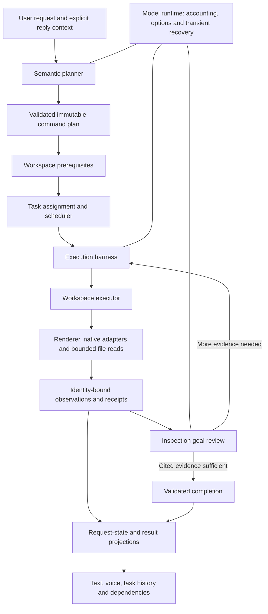

# Orchestrator harness overhaul

September 9, 2026. This implements the follow-up to the
[architecture investigation](orchestrator-architecture-review.md), including the
requested folder/project controls. It replaces central responsibilities and
changes the planning/execution contract. Source and the development build are
updated; the installed 0.1.109 application has not been replaced.

## Operating model

The planner describes the user's goal and authority. The assignment service owns
conversation discovery and reuse/creation. The workspace executor owns action
validation, observations, delivery and effect deduplication. The execution harness
owns model/tool protocol and progress limits. A model's completion statement cannot
replace delivery receipts or observed inspection evidence.

## Ownership boundaries

| Owner | Responsibility |
| --- | --- |
| `orchestratorPlannerPrompt.cjs` | One coherent planning contract, reduced from about 26,000 to 7,900 characters. Native keystroke execution belongs to the executor. |
| `orchestratorPlannerTools.cjs` | Separate typed planning tools for task assignment, blank terminals, unsent drafts, inspections and workspace actions; optional request metadata. Operation calls assemble into one validated plan. Legacy full-plan responses remain locally validated for adapter compatibility. |
| `orchestratorInterpretationSchema.cjs` | Compact per-operation schemas, current/pending authority visibility, required new-task fields, and lossless relocation of a misplaced `access` field. Conflicting scopes and unknown arguments remain rejected. |
| `orchestratorInterpreter.cjs` | Context projection, interpretation validation, separate contract/review repairs, target selection and purpose checks. Unaddressed conversation IDs are omitted; provider/project capability summaries support inspection selectors. |
| `orchestratorModelRuntime.cjs` | Shared model accounting and diagnostics; one option repair and one transient HTTP 502/503/504 retry. This layer has no terminal dispatch interface. |
| `orchestratorExecutionHarness.cjs` | Ordered tool batches, unique tool-call identities, complete result pairing, cancellation and bounded progress detection. Tokens, timestamps and step counters cannot manufacture progress. |
| `orchestratorWorkspaceExecutor.cjs` | Actual scoped actions, fresh identity/input checks and deduplication, through narrow workspace adapters. Request context is passed explicitly. It has no credential store or unrestricted model API. |
| `orchestratorGoalReview.cjs`, `orchestratorInspectionCompletion.cjs` | Review whether permitted terminal evidence answers an inspection goal, continue navigation when needed, and propose completion through the ordinary validators. A bare initial prompt cannot trigger automatic completion. |
| `orchestratorInspectionEvidence.cjs` | Bounded request-local excerpts, tied to pane, generation, process and conversation. Completed inspection reports quote observed content when model wording is not supported. |
| `orchestratorRequestState.cjs` | Shared unfinished-work and lifecycle projections. Delivery completion, native results, cancellation and transferred ownership remain distinct. |
| `orchestratorProjects.cjs`, `removeProjectOperation.ts` | Project prerequisites, frozen project-removal scope and retained per-terminal stop transactions. No filesystem deletion interface exists in project removal. |
| `workspaceNavigation.json`, `orchestratorWorkspace.cjs` | Shared renderer/backend destination catalog and a bounded current-workspace map. |

The main coordinator still owns scheduling, continuation transfer and background
result reporting. Those existing owners were retained with their regression
coverage. This is a substantive migration of planning, model transport, execution,
goal completion and project lifecycle; it does not claim every remaining method
has become small or that native provider behavior is deterministic.

## Workspace and folder behavior

- `open_folder` reveals an existing directory in the system file manager.
- `add_project` registers an existing directory and opens it as a Lina project.
  It does not create or replace that directory.
- `remove_project` captures an existing project and its pane identities, verifies
  their stops, and removes the project entry. It returns `filesDeleted:false`.
  A changed project, new/restarted pane or unverified stop cannot receive a false
  successful removal receipt.
- Partial removal retains original stop-operation IDs. Retry observes an already
  issued stop and continues only the remaining original operations. A vanished
  pane is not process-stop proof. The Orchestrator retains this unfinished removal
  scope so Retry does not forget it.
- Documents, Desktop, Downloads and registered projects provide known folder
  locations. An explicitly user-provided folder path can authorize opening or
  adding that particular directory outside those locations. Model arguments cannot
  supply the private path-authorization marker.
- Workspace prerequisites are verified before dependent worker assignment.
  “Add this folder, then open a Codex there to investigate” preserves both effects
  and the complete coding objective. Known workspace/lifecycle prefix operations
  keep their declared order. Failure stops dependent startup and retains progress.

The twelve destinations cover the dashboard, relay conversation, history,
activity, changes, files, setups, the three settings panels, the multi-project
board and a selected project board. `read_workspace` reports current state and
available discovery operations. Current-project context is reference data; it does
not implicitly select an existing conversation for independent coding work.

`read_file` reads bounded UTF-8 pages within allowed roots. Its cursor and source
reference detect changes and support files larger than the directory-list offset
limit. Bookmarks advance only after model delivery, and clipped pages retain their
position. Same-source read recovery cannot clear an unrelated file's failure.

## Task and inspection behavior

`delegate_task` owns unselected coding work. Explicit task-mode `operate_terminal`
owns a handoff to a user-selected existing conversation. General interactions
retain their observe/act/verify scope. `inspect_terminal` supplies fixed
informational scope and resolves a unique provider/project selector or addressed
pane. It does not require the model to invent a collection of access and execution
mode fields.

Planning uses separate named tools for executable work, blank terminals and
explicitly unsent drafts. Blank and draft proposals receive a purpose check before
any effect: opening an idle pane cannot silently replace a requested investigation.
The check includes separately proposed tasks so intentional mixed requests remain
possible. Contract and purpose repair preserve the original work, and named
multi-operation responses are exercised through the full request/delivery path.

Task handoffs can finish from verified delivery and a post-send observation even
when the model omits a read or finish call. Native work remains tracked separately;
delivery is not task completion. Inspections add an application-managed goal loop:
observe effects, review cited evidence, continue if information is missing, and
finish through the same identity and observation validators. Goal review cannot
create new actions or expand permissions. Inspection output preserves the meaning
of the terminal's own figures instead of turning token statistics into quota.

Contract repair and semantic-review repair each have one allowance. Recovery keeps
the original objective while dropping obsolete field recipes for rejected action
types. Expired source IDs cannot revive completed deliveries; fresh follow-up work
uses current authority. Original frozen payloads and execution policy survive
explicit Retry. Repeated unchanged tool rounds stop; real new evidence resets the
bounded premature-reply allowance.

## Verification evidence

Verification uses disposable profiles and synthetic projects. The real Electron
navigation/removal test checks all twelve destinations, stops a real project PTY,
removes and re-adds the project, verifies a marker file remains intact, and preserves
an unrelated running terminal. Backend tests cover project scope changes, partial
stop recovery, missing source evidence, malformed judgments, unknown writes,
cancellation, context budgets and exact-once task delivery.

Final source acceptance passed:

| Check | Result |
| --- | --- |
| Backend, Orchestrator, voice and provider regression suite | 1,960 tests passed; zero failures or skipped tests. |
| Full frontend suite | 53 tests passed, including retained project-removal operations. |
| Combined `check:orchestrator` acceptance | Passed build/type checking, runtime/telemetry checks, renderer/voice checks and isolated Electron task/session-resume checks. |
| Electron navigation and project lifecycle | All 12 destinations passed; a real project PTY stopped, its project was removed/re-added, its marker file survived, and an unrelated terminal remained running. |
| Configured-model inspection matrix | All 10 scenarios passed through the current named planner and goal-review loop. |
| Configured-model project/task and incident recovery | Both passed; each created one worker and sent the complete task once. The project scenario added its folder first. |

The combined command now also includes the removal regression tests and the
navigation smoke. These two additions passed in the full frontend suite and
separate post-build navigation run on this source revision. The existing Vite
bundle-size advisory remains; it did not fail the build.

Local reports are under `.tmp/harness-final-*`. Current live-model evidence includes:

- Ten native-information/existing-result scenarios passed with the configured
  Mercury model in `.tmp/orchestrator-terminal-inspection-live/1789008664444-50580/`.
  These use explicitly synthetic provider screens and native-adapter fixtures.
- Add-project/create-worker/send passed with one of each effect in
  `.tmp/orchestrator-recovery-live/1789008732480-21388/` (four model calls).
- The two-initial-error incident reproduction passed through the shorter planner,
  normal routing and delivery in
  `.tmp/orchestrator-recovery-live/1789008732480-48840/` (five live model calls
  after two scripted initial faults).
- Real Electron project/file preservation evidence is under
  `.tmp/orchestrator-navigation-smoke/1789008732712-44572/`.

Earlier live runs exposed schema violations, premature reports, unnecessary
navigation, fixture gaps and one HTTP 502. Their failures remain in the local
reports; successful reruns are not a production error-rate estimate. Fixtures now
support staged command entry, informational discovery and repeated tab navigation,
and report unsupported fixture controls as proven-unsent instead of fabricating
an uncertain native write.

The model catalog advertised structured-output support, but an explicit strict
JSON-schema probe still returned an unoffered action on the tested endpoint.
Production therefore keeps local validation authoritative. OpenRouter documents
that enforcement and schema support vary by endpoint; the probe is retained as
`--json-intent` for diagnostics, not enabled as a claimed enforcement guarantee.
See [OpenRouter structured-output documentation](https://openrouter.ai/docs/guides/features/structured-outputs).

## Boundaries

These checks do not certify every wording, physical microphone, real provider
menu/version, external account state or malicious terminal rendering. Goal review
is a bounded model judgment over cited observations, not independent proof of
arbitrary coding outcomes. Raw native UI interaction still depends on observed
provider behavior and its supported controls. The existing conservative input,
permission, generation, unknown-write and startup fences remain enforced.

Project transaction recovery is scoped to the running application. There is no new
crash-safe replay journal, and a restart does not recreate executable authority
from saved history. The running installed app has not been restarted, replaced or
sent these test tasks. Packaging/publication/installation are separate release
steps.
