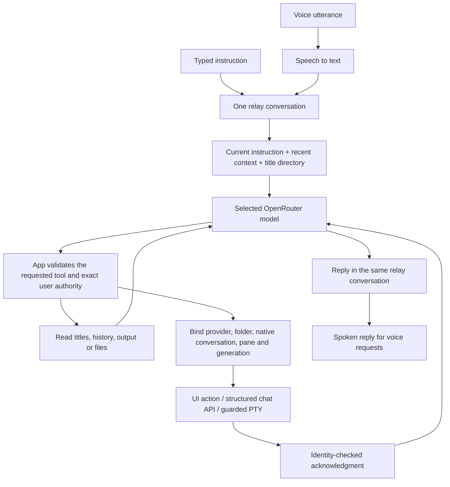

# Orchestrator harness: operating model and edge-case review

The Orchestrator is one ongoing relay conversation for the running application.
Individual terminals keep their own native conversations. Their titles and stable
identities form a directory the relay can search; they do not become separate
Orchestrator chats, and their full transcripts are not loaded into every request.

This review traced the actual renderer, model loop, policy, history service,
terminal delivery adapters and acknowledgments. It found concrete failures that
ordinary happy-path tests had missed. The fixes and verification below describe
the implementation, not a claim that every external CLI or microphone has been
tested live.

The later [progressive context and local error audio review](orchestrator-context-and-audio.md)
adds local transcript search/paging, enforced model-input budgets and offline
error speech.

## What the model receives

Each request uses the user's selected tool-capable OpenRouter model. The app sends:

- The current instruction and the relay's authority rules.
- Up to eight recent relay messages, including visible observational updates,
  as context data. Old commands never authorize new effects.
- A compact first page of current session metadata: titles, aliases, pane IDs,
  native conversation IDs where known, provider/home, folder, status and launch
  generation. Larger directories are explicitly paginated/searchable.
- The current generation-bound target, or a pending target tied to the exact
  acknowledged launch token while a new/resumed pane starts.
- Known project roots and explicitly saved user preferences.

The visible relay retains up to 100 messages in RAM. This is bounded context,
not unlimited memory or a new permanent transcript archive. Credentials,
preferences and workspace configuration persist separately. Native provider
histories remain in their original stores.

Provider transcript text enters a request through `read_session` or
`read_conversation`. Tool results are bounded before serialization; the model
always receives valid JSON. If a directory page itself must be shortened, its
pagination cursor is removed and the model is told to retry the same query with
a smaller page, so it cannot silently skip unseen entries.

## Request flow

The model decides which tool to request. Application code decides whether that
request matches the user's instruction, whether the target identity is current,
and whether the adapter can deliver it. Terminal output, titles and preferences
are data; none can authorize an effect.

The loop has at most five model rounds and six tool calls per round. It does not
run indefinitely. Reaching a limit reports a limit, with existing action receipts
retained so the user can see what already happened.

## Tool map

| Purpose | Model-facing operations | Actual behavior |
|---|---|---|
| Current sessions | `list_sessions`, `read_session` | Search/paginate title metadata; read a bounded current screen/chat excerpt and any current structured interaction. |
| Saved conversations | `list_conversations`, `read_conversation`, `resume_conversation` | Search native titles/IDs; read bounded user/assistant prose; revalidate and open the exact selected identity. |
| Send instructions | `stage_draft`, `send_prompt` | Stage text or deliver/queue the complete explicit user payload to one identified session. |
| Session controls | `focus_session`, `create_session`, `interrupt`, `restart`, `close` | Perform only the named operation. Opening/revealing changes the app's selection; ordinary prompt delivery does not activate its window. |
| Folders and files | `search_files`, `create_project`, `add_project`, `open_file`, `open_folder` | Work within Documents and known projects, using canonical paths. Project creation uses the OS Documents location. File/folder opening requires an explicitly identified path or a direct UI action. |
| Saved setups | `list_setups`, `read_setup`, `save_setup`, `launch_setup` | Read or explicitly launch named configuration recipes; saved starting prompts are staged. |
| Explicit memory | `list_preferences`, `remember_preference`, `forget_preference` | Store/remove only the preference the user explicitly supplies. |

The model does **not** receive permission-approval or question-answer tools.
Structured answers use the user's GUI selection or the separate literal voice
answer path, with request ID, session, generation, revision and option validation.
The direct UI bridge also has operations such as draft retrieval and frozen
handoffs; those are not unrestricted model tools.

## How titles identify the intended work

Titles are mutable labels. Execution identity is stronger:

1. Native provider and its home (`global`, custom Claude, or app-owned Open Fusion).
2. Working folder and native conversation ID.
3. Current pane ID and launch generation when there is a live session.

Current listings favor the runtime's fresh conversation title over a stale UI
inventory label. Known display aliases remain searchable. Model execution still
uses the frozen identities captured for the request and rechecks the current
generation at the effect boundary.

Saved history uses opaque references instead of model-supplied transcript paths.
Opening by title has two checks: the current instruction identifies a candidate,
then fresh native discovery verifies that the title/ID is unique in the scope the
user actually named. A unique row in one cached page is not proof of uniqueness
across the archive.

For example:

- `Find current and saved conversations about checkout` searches titles first.
- `Resume Codex conversation "Checkout validation" in Website` identifies a
  title/provider/folder. If two known folders are both named Website, the full
  path or an explicit History selection is needed.
- A title renamed between listing and opening is revalidated. The relay does
  not silently substitute a different conversation with the old title.
- A direct click on a History row already supplies an explicit opaque identity;
  it does not need to pretend a title is globally unique.

An existing matching live conversation is revealed. A matching paused or
confirmed-exited native pane is resumed. Otherwise, the app creates a new pane.
Native identity includes the folder, preventing an unrelated pane with the same
provider/ID in another folder from being reused.

## Follow-ups such as “tell it…”

The review reproduced a serious defect: focus A, resume B, then `Tell it: continue`
could send to A. This is corrected.

An authorized create/resume clears the previous target before dispatch. A
successful acknowledgment binds the returned pane only to its verified current
generation. If the pane is still starting, the relay waits for the exact expected
launch token, with a bounded lifetime; it can tolerate an older UI snapshot while
that launch advances, but cannot adopt a later replacement launch. A reported
native generation must match exactly.

Failure, ambiguity or expired startup does not fall back to the previously
selected terminal. A late successful acknowledgment from an older generation
also cannot bind its replacement. Unrelated restarts invalidate a follow-up
target and require it to be identified again.

For `Tell it: inspect the failed test; do not change files`, the model may request
`send_prompt` without repeating the text. The harness extracts that entire payload
from the current user instruction. If the model supplies different text, it is
rejected. This also avoids forcing long prompts through the model's relatively
small tool-call output budget.

## Delivery and cancellation

Fusion/Open Fusion use structured input/steering paths. Standalone agents use
guarded PTY writes. The adapter distinguishes idle input readiness, observed busy
work, pending questions, unknown input state, exited agents and exited shells.

| Situation | Result |
|---|---|
| Ready structured chat | Its native host acknowledges input/steering. |
| Long-idle native agent with verified root process and stable readiness | Fresh guarded transport check; no arbitrary five-second inactivity rejection. |
| Observed busy/pending native turn | Exact prompt waits in a bounded in-memory queue. |
| Unknown input state, queue expiry, or unsent human input in the terminal | Preserve a draft; do not append into an uncertain composer. |
| Agent exited, shell still alive | Report not running; never treat the shell as the agent. |
| Pending approval/question | Do not turn a new task into an answer or approval. |
| Multiline TUI prompt | Use confirmed bracketed-paste mode or stage it. |
| Cancel before effect dispatch | No dispatch. |
| Cancel after a UI/host request was dispatched | Preserve the actual acknowledgment or report unknown; do not claim an already-sent action was prevented. |
| Missing or mismatched acknowledgment | Remain unconfirmed; no automatic retry. |

Acknowledgments now match engine, action ID, session ID and generation. The
review proved that action ID alone was insufficient. Inventory replies are also
sequenced, so an older response cannot overwrite a newer directory snapshot.
Filesystem validation checks cancellation again immediately before opening a
file or folder.

A new informational relay request does not revoke an earlier queued command.
Explicit cancellation, disabling or reconfiguration cancels undispatched queued
work. Queue limits are 50 entries and a 120-second readiness wait. Submission
reservations prevent two sends from using the same old idle observation.

`written` means the PTY accepted the bytes. It does not prove the model consumed
them or completed the task. Completion requires native runtime/chat evidence.

## Remaining boundaries

- Title search covers known workspace folders and native stores, not a global
  full-text semantic index of every conversation ever stored on the machine.
- Native discovery/reading is bounded. An incomplete search cannot authorize a
  unique model-selected title; narrow the provider/folder or use direct History
  selection. Missing CLIs and unreadable stores are reported rather than guessed.
- A custom Claude profile is used only when ownership is proven. Closing its
  last owning pane can remove that proof. Likewise, old Codex history cannot
  always prove that it originated in Fusion; ordinary chats are no longer
  mislabeled as Fusion merely because they share a folder.
- Plain shells have captured current display history, not an agent conversation
  archive that can be resumed.
- Individual terminal providers are supported. A blanket `ask every terminal`
  broadcast command is not currently a model tool.
- Saved-history selections such as "open the first one", "yes", or "the latest"
  are not yet a server-bound selection dialog. Use the exact title/native ID or
  select a History row; the model is not allowed to guess a candidate.
- Ambiguous/conditional natural-language effects can require a clearer command.
  This is a command relay, not a general autonomous desktop operator.
- Local wake detection and bounded audio handling are implemented; STT, the
  selected relay model and TTS use the user's OpenRouter account. Live cloud
  responses and physical microphone acoustics were not verified by offline tests.

## Verification

The final targeted suite has 158 passing tests. New cases cover A-to-B follow-up
binding, provisional launches, replacement generations, hidden duplicate titles,
renames, punctuation, folder/home identity, Fusion provenance, wrong host
acknowledgments, late cancellation, out-of-order inventory and valid bounded JSON.
Frontend identity, workspace and dock helper checks also pass. Model tool
selection and free-form summaries remain probabilistic; actual action receipts
and native evidence are authoritative. Live chosen-model evaluations are still
needed to measure reliability across natural speech/wording.

The dock now drags to zero content height, retains its tabs/grip, remembers its
collapsed state and pulls open continuously. Project rows have reorder grips,
keyboard movement and persisted order. Separate Electron tests exercised both
controls and verified unchanged running terminal identity/layout; project drag
testing also covered insertion lines, cancellation and long-list edge scrolling.

The command E2E harness uses real Electron, preload/IPC, a real PowerShell PTY and
native history fixtures, with scripted model replies and a fake provider
executable. Its results must be read separately from live-model acceptance.
See [validation evidence](orchestrator-validation.md) for final artifact paths and
the current live-test boundary.

Main implementation: [relay loop](../backend/orchestrator.cjs),
[context projection](../backend/orchestratorContext.cjs),
[authority policy](../backend/orchestratorPolicy.cjs),
[native history](../backend/orchestratorHistory.cjs),
[adapter integration](../backend/orchestratorIntegration.cjs), and
[background delivery](../backend/orchestratorDelivery.cjs).
