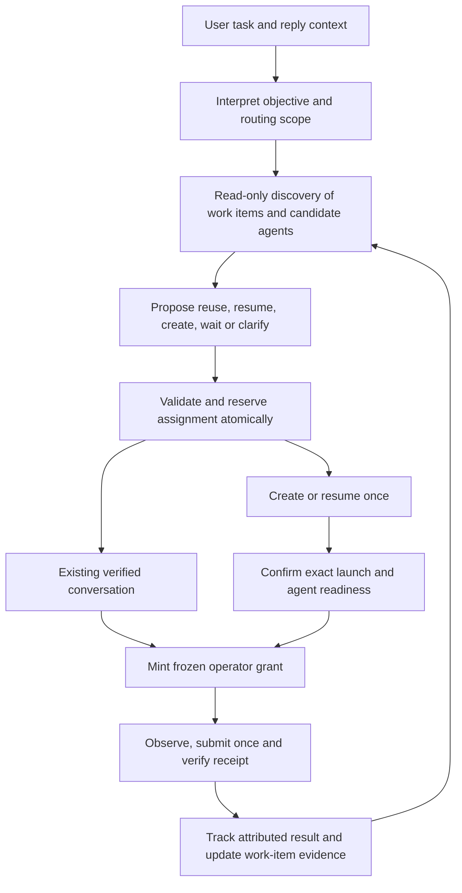

# Automatic terminal assignment: harness deep dive

## Implemented behavior

The [September 9 ownership repair](orchestrator-task-ownership-review.md) closes an
earlier boundary: interpretation could mistake a provider/project request for a
selected existing terminal and bypass this routing stage. Current new-work defaults,
selection checks and the latest live-model limitations are recorded there.

The later [cohesion review](orchestrator-cohesion-review.md) checks the complete
request path and repairs adapter, lifecycle and persistence gaps missed by the
original implementation fixtures. The acceptance counts below describe that
earlier implementation run; current combined verification is in the cohesion review.

Automatic assignment is now implemented in source. A natural task without an
explicit terminal can compile to `delegate_task`, with a known project, complete
objective, optional configured launcher and work-item association. A bounded
read-only routing stage can inspect live conversations and page/search beyond the
initial directory before choosing reuse or creation. Explicit terminal controls,
random selection and all-target instructions retain their existing behavior.

The selected agent's identity is frozen only after routing. Creating an agent
claims one creation action without a draft, confirms the actual launch and agent
readiness, then binds an operator grant under the original request and submits
through the normal observe-act-verify loop. Creation alone never creates a task
result wait. Known slow launches can be recovered by their exact pane and launch
token; uncertain task delivery cannot be replayed or migrated.

Work items connect related requests to their conversation. Pending creation is
reserved once, so a related request can share the worker while it starts.
Independent tasks get separate conversations. Automatic workspace lanes respect
earlier managed submissions, including work explicitly assigned to a terminal;
compatible continuations and terminal controls remain usable. Completing a turn
does not erase conversation affinity or resolve an unattributed busy follow-up.

Native conversation identity is checked through queued input, clarification and
deferred review-then-fix steps. When a newly created agent first reports its native
conversation ID, active bindings latch it. Restarted generations or a different
native conversation cannot inherit the old task's input authority.

`orchestrator-work-items.json` stores bounded, redacted historical associations,
not executable grants or live reservations. Original objectives retain the full
supported user instruction; discovery uses compact summaries and selected
continuations receive the original objective as reference context. Restored
associations require current identity evidence. Routing decisions appear in task
details, and private diagnostics include assignment decisions and model-input
bytes without storing transcripts.

Implementation files:

- [`orchestratorIntent.cjs`](../backend/orchestratorIntent.cjs) and
  [`orchestrator.cjs`](../backend/orchestrator.cjs): scoped delegation, binding,
  discovery, creation, continuity and execution.
- [`orchestratorRoutePlanner.cjs`](../backend/orchestratorRoutePlanner.cjs),
  [`orchestratorRouting.cjs`](../backend/orchestratorRouting.cjs), and
  [`orchestratorWorkItems.cjs`](../backend/orchestratorWorkItems.cjs): bounded
  selection, reservations, exact creation recovery and historical affinity.
- [`orchestratorTasks.cjs`](../backend/orchestratorTasks.cjs),
  [`orchestratorLaunchers.cjs`](../backend/orchestratorLaunchers.cjs), and
  [`orchestratorIntegration.cjs`](../backend/orchestratorIntegration.cjs): task
  ownership, configured launchers, startup and transport identity checks.

Verification includes the full backend/voice suite, renderer build, task/routing
frontend checks, hidden Electron/preload/real-PTY command smoke, six configured
Brain routing scenarios, and configured-Brain creation plus busy follow-up through
the real interpreter/router/operator with disposable agent adapters. Current run
details are recorded in `.tmp/routing-implementation-20260907/` and
`.tmp/orchestrator-routing-live/`. The hidden command fixture reads typed action
receipts rather than requiring conversational replies to contain JSON.

Final parent acceptance: **1,093 backend/voice tests passed**, renderer build and
three frontend checks passed. Hidden Electron/PTY smoke evidence is in
`.tmp/orchestrator-command-smoke/1788834637699-53180/`. The parent's configured
Brain create-and-submit run passed at
`.tmp/orchestrator-routing-live/1788834637729-38024/report.json`; the earlier
two-case create/busy-follow-up run is
`.tmp/orchestrator-routing-live/1788834191283-38144/report.json`. An optional third
pipeline scenario stopped at the local QA spending bound before another model
request; the separate six-case routing evaluation covers independent selection.

These checks do not certify every installed CLI's native UI. First sends without
a native conversation ID rely on exact launch, known scope and fresh input
observations until the ID becomes available. Worker context utilization remains
unknown where providers do not report it; no percentage rollover rule or measured
context-saving claim is implemented. Saved history can inform a handoff, while
automatic resumption of a closed historical owner remains outside this routing
stage; explicit history resumption remains available. Changes are in source and
the local build, not an installed release.

## Original investigation

The following evidence and proposed design were written before implementation.
The implemented behavior above supersedes proposals where they differ.

Investigated September 7, 2026, against the working tree based on
`08f467f308be3cf1d53ac3fff3d8d86fa91481fa`. Concurrent, pre-existing Orchestrator
status/reporting edits were present. This document records source findings and a
proposed implementation; automatic task routing has not been implemented by this
investigation. The current [controls](orchestrator-controls.md) and
[tasks](orchestrator-tasks.md) contracts take precedence over the historical
[harness review](orchestrator-harness-review.md).

The recommended change is a **task assignment stage before terminal grants are
frozen**, backed by durable task-to-conversation associations. It should reuse the
agent that owns related work, choose a fresh conversation for independent work,
and create a configured worker when necessary. Existing observation, authority,
delivery and result-attribution machinery should remain the execution boundary.

The most immediate blocker is concrete: creation with initial text currently saves
a draft, does not send that text, and cannot grant subsequent operator access to
the newly created terminal in the same request. Its draft-only creation receipt
can also be mistaken for task delivery by the scheduler.

## What the harness actually does

| Stage | Current behavior | Routing consequence |
|---|---|---|
| Request interpretation | `interpret_workspace` receives the instruction, request/reply context, earlier task descriptors and up to 200 session summaries, subject to context reduction. It has no read-tool loop. | It must select terminal IDs before it can inspect their output or search beyond its initial directory. |
| Target binding | `normalizeIntent` requires concrete IDs for terminal operations and freezes their generations. Multiple candidates with `selection: 'one'` use `randomInt`. | A singleton can be chosen semantically from metadata. Delegating a choice over several IDs currently means random choice, not suitability ranking. |
| Scheduling | Targets and lanes are constructed from the grants before `tasks.ready`. Interpretation is serialized; up to two execution model calls can run alongside routing. | Scheduling waits for already chosen resources. It does not reconsider which conversation best fits the task. |
| Execution | The executor starts with up to 40 session summaries and can list, search and progressively read more. Its available effects come from the existing grants. | Better evidence discovered here cannot freely retarget a grant or create a worker. |
| Creation | Bound creation text becomes `payload.prompt`; the renderer saves a draft and returns `draftStaged: true`. | Opening a pane does not start its task. A verified creation-to-operator transition is missing. |
| Busy delivery | Supported Codex composers accept guarded follow-ups; other native agents may queue proven-unsent prompts; Fusion/Open Fusion have structured paths. | The ability to send while busy does not establish that the new task belongs in that conversation. |
| History | Request associations and observed work endings persist; executable grants and live queues do not. | There is useful evidence for affinity, but no durable logical task owner across requests, pane replacement and native conversation resumption. |

Source anchors: [`interpret` and `runJob`](../backend/orchestrator.cjs),
[`normalizeIntent`](../backend/orchestratorIntent.cjs),
[`scopedWorkspaceTool`](../backend/orchestratorToolSchema.cjs),
[`createTaskScheduler`](../backend/orchestratorTasks.cjs),
[`sessionSummary`](../backend/orchestratorContext.cjs), and the
[`create_session` renderer handler](../frontend/App.tsx).

Unnamed tasks are **not categorically rejected**. The interpreter can already
infer a known singleton terminal from metadata. The missing contract is how it
should establish ownership, evaluate reuse against creation, discover missing
evidence, and complete the resulting assignment. Simply adding “choose the best
terminal” to the system prompt would leave those gaps in place.

## Findings that affect the design

### 1. Discovery happens too late for evidence-based assignment

`orchestrator.cjs` builds the interpreter payload in `interpret` (around line 384)
and freezes targets in `runJob` before execution. The default interpreter sees
only its bounded first directory page; injected test interpreters can see a
richer context, so those tests can conceal this limitation. `normalizeIntent`
binds IDs/generations at lines 190–202. The executor's later `list_sessions`,
`read_session`, `list_work` and history reads cannot expand its grants.

Session summaries contain titles, aliases, folder, provider, native conversation
ID, generation, turn state, pending input and recency. They do not contain a
logical task owner or normalized launch/delivery capabilities. Titles and folder
matches help shortlist candidates, but two terminals in the same repository can
be doing unrelated work. Missing metadata does not prove a conversation is empty.

Preserve literal requests for a random terminal. Automatic suitability selection
needs its own explicit contract; it must not reuse `selection: 'one'` over a set
and silently randomize a carefully ranked choice.

### 2. Creation has both an execution seam and a receipt defect

The verified creation path is:

1. `orchestrator.cjs` copies creation `text` to `action.prompt`.
2. `orchestratorIntegration.cjs` forwards `prompt` to the renderer.
3. `App.tsx:4699–4701` calls `writeSessionDraft` and returns `status: 'created'`
   with `draftStaged: true`.
4. `orchestratorLaunch.cjs` can confirm the native process and actual generation;
   it preserves the draft flag. Neither launch confirmation nor target binding
   submits the draft.
5. `authorizeIntentAction` cannot use a create grant to send to the returned ID.
   `afterResults` also rejects a plan whose only initial task is creation.

Separately, `orchestratorTasks.cjs:105–122` tracks creation with a prompt and treats
statuses other than `queued`/`staged` as delivered. It does not inspect
`draftStaged`. A parent-run scheduler probe using the actual renderer receipt
shape produced:

```json
{
  "deliveryStatus": "created",
  "staged": false,
  "delivered": true,
  "baselineIdle": true
}
```

This proves a draft receipt is classified as delivered at that boundary. A later
unrelated turn potentially satisfying its result wait is an inference from this
state and the missing submission baseline; that full UI scenario was not tested.

The new automatic path should **create without a prompt, confirm the agent is
ready, bind an operator grant to the returned generation, then send once**.
Explicit creation-with-draft behavior can remain supported, but its receipt must
stay unsent and cannot create a completion dependency. Do not hide submission
inside a pane-created acknowledgment.

### 3. Control access and task ownership need separate scheduling rules

`orchestratorTasks.cjs:79–97` deliberately allows an operator to access a terminal
after an earlier operator has dispatched work. That is needed for answers,
observation, interruption and compatible follow-ups. `runJob` creates workspace
lanes for ordinary non-operator sends, but excludes operator targets from that
workspace-lane construction.

Thus, the existing same-worktree serialization is not a general guarantee for
modern operator-submitted tasks. An automatic router could send unrelated work
into a busy agent or start conflicting mutations in another terminal without an
additional task-ownership rule. Opening a second terminal does not isolate files.

Add task-submission ownership checks while preserving operator access for
controls. Use canonical worktree identity from
[`orchestratorWorkspaceIdentity.cjs`](../backend/orchestratorWorkspaceIdentity.cjs),
which resolves junctions/subfolders and distinguishes linked worktrees. Begin with
conservative same-worktree mutation scheduling; claimed disjoint filenames alone
do not establish safe independent writes. Separate worktrees can permit actual
parallel mutation when their creation/use is within the task's scope.

### 4. Request, task, conversation and terminal are different identities

| Identity | Meaning | Lifetime |
|---|---|---|
| Request ID | One user instruction, reply, receipts and authority source. | One submitted request and its history. |
| Work item ID, proposed | One coherent objective with constraints and a chain of related requests. | Can outlive several requests and a terminal launch. |
| Native conversation identity | Provider, exact home/profile scope, canonical workspace and native conversation ID. | Survives a pane closing when provider history remains available. |
| Execution binding | Pane ID, generation and expected launch token. | One verified live launch. |
| Submission/result identity | Action ID, dispatch baseline and attributed provider turn. | One delivery and its observed result. |

The existing scheduler's `task.id` currently equals `requestId`; it is not a
cross-request work item. Add a distinct `workItemId` rather than changing that
existing meaning. Independent review and implementation agents should receive
separate child work items linked to the same larger goal, so task affinity does
not collapse every related agent into one conversation.

[`orchestratorConversationStore.cjs`](../backend/orchestratorConversationStore.cjs)
persists historical associations and pauses unfinished work on restore.
[`orchestratorWork.cjs`](../backend/orchestratorWork.cjs) adds bounded observations
of agent turn endings, including work started directly in terminals. Both are
evidence sources, not restored permission to dispatch. Persisting affinity must
preserve that distinction.

### 5. Conversation efficiency needs two separate budgets

The Orchestrator already reduces its own input through compact metadata,
progressive reads and [`orchestratorBudget.cjs`](../backend/orchestratorBudget.cjs).
Its input ceiling is 48,000 serialized bytes under a conservative budget formula;
this is not a measurement of a worker's remaining context.

There is no normalized worker context utilization in `sessionSummary`. Fusion's
Codex adapter observes some token usage internally, but that is not a reliable
cross-provider routing metric. A rule such as “start a new terminal at 80%” cannot
currently be implemented truthfully across agents.

Optimize initially for relevant context: reuse the owner of the same objective,
retrieve only the evidence needed to decide, and use a compact handoff when a
fresh conversation is appropriate. Treat unknown context capacity as unknown.
Measure real routing latency, prompt/context bytes and task outcomes before
claiming savings or introducing rollover thresholds.

## Proposed routing behavior

This table defines the automatic-task contract. Existing explicit terminal
controls retain their named-target behavior.

| Situation | Assignment |
|---|---|
| User names a terminal or exact conversation | Honor it after identity validation; a blocker does not silently authorize substitution. |
| User replies to a particular request: “also test the edge cases” | Resolve that request's work item and owner, even if another terminal received the most recent unrelated request. |
| Same objective, owner ready | Reuse its verified conversation. |
| Same objective, owner busy, prompt refines current work | Use supported busy steering or the immutable readiness queue. Preserve attribution limits. |
| Same objective, next step requires a result | Wait for the attributed prerequisite result, then prepare and submit the next step. Busy steering cannot substitute for this dependency. |
| Owner is still being created | Attach to its pending assignment reservation; do not create a duplicate worker. |
| Owner conversation is saved but not live | Resume the exact verified identity if continuation is appropriate and resumption is within scope; otherwise prepare a handoff. |
| Independent task; suitable, verified unused agent exists | Assign that agent in the correct project and bind a new work item. Idle alone does not prove unused. |
| Independent task; existing conversations belong to other work | Create one compatible configured worker, subject to capacity and workspace scheduling. |
| Independent review or explicit fresh-context request | Use a distinct child work item/conversation and a bounded evidence handoff. |
| Relevant terminal has human input, a pending question or uncertain delivery | Preserve its state. Resolve the actual blocker, queue when supported, or report it; do not resend the same task elsewhere. |
| Project is genuinely ambiguous, or a required provider is unconfigured | Ask for the missing project/configuration choice once and retain the original task. |
| Explicit random/all request | Preserve random selection or the exact frozen all-target set; do not reinterpret it as automatic ranking. |

For example, “Fix checkout validation in Store” creates or selects the checkout
work item. “Also cover expired coupons,” replied to that request, returns to the
same agent while it works. “Update Store's deployment guide” becomes separate
work. A separate conversation may be useful, but both agents' file mutations
still obey the worktree scheduling policy.

Use hard filters before semantic ranking: project/worktree, explicit target and
provider constraints, configured launch capability, identity validity, ownership
and delivery uncertainty. Rank remaining candidates by work-item continuity,
verified relevant conversation evidence, suitability and readiness. Titles and
recency are secondary hints. Do not treat a model-generated confidence number as
an independently calibrated safety threshold.

## Proposed harness contract



The result-to-discovery edge supplies context for a later user request or an
already-authorized dependent step. It does not grant an unlimited self-directed
planning loop or new objectives.

### Intent and discovery

Introduce a proposed `delegate_task` intent kind for automatically assigned work.
It authorizes the user's objective plus bounded resource selection, rather than
pretending an unknown future terminal ID is already known. Keep existing
`operate_terminal` for explicit terminals and native controls.

The application-owned routing grant should retain:

- Source request, complete objective, exact-prompt mode when requested, constraints,
  answer/permission/lifecycle modes, and explicit result dependencies.
- Canonical project scope, allowed configured launchers, whether reuse/create/resume
  is permitted, and a bounded worker-creation allowance for the objective.
- Explicit target or reply-owned work-item association when present. Candidate
  task summaries and terminal prose remain separately labeled reference data.

Automatic assignment can be the product's ordinary task behavior: a user delegates
work and the app supplies its established routing policy with that request.
It should not require asking permission for every normal terminal choice. The
compiler must still distinguish work requests from questions/hypotheticals and
must not treat free-text saved preferences or terminal content as new authority.

Provide a small read-only discovery loop over work-item summaries, session
metadata, launcher capabilities and targeted history/output. It must be able to
search beyond the initial directory page before effects are bound. Explicit
targets and known owners can take a short path through the same validation;
do not require an extra model exchange for every obvious continuation.

### Work-item records and routing receipts

Add a versioned, bounded `orchestratorWorkItems.cjs` store, separate from the
existing observed-work log. Proposed records contain the objective, source
requests, constraints, canonical workspace, parent/child work relationships,
native conversation association, assignment history and compact result evidence.
Every derived summary records its source request/turn and freshness. Keep durable
conversation identity separate from the ephemeral live pane binding.

Add an in-memory routing registry in a proposed `orchestratorRouting.cjs`. Its
assignment receipt records `requestId`, `workItemId`, assignment ID/revision,
decision, candidate evidence, target or pending creation token, and linked action
receipts. Neither the model's explanation nor a persisted receipt is an executable
grant. Reopening the app revalidates associations and pauses unresolved work.

Use explicit lifecycle facts such as unassigned, reserved, launching, bound,
queued, submitted, awaiting-result and blocked. Keep delivery uncertainty separate
from completion. A request cancelled after submission must retain its still-active
work ownership until reliable result or interruption evidence releases it.

### Reservation, binding and reassignment

Under the routing critical section, validate the proposal against the current
registry/inventory revision, reserve the work item and worker capacity, and
register relevant workspace ownership. Then release the routing lock before
waiting for launch, provider readiness, questions or task results. Unrelated
requests must remain routable during those waits.

For reuse, bind the verified pane/generation and native conversation when known.
For creation, reserve first, create without draft text, confirm the exact launch
token/generation and provider readiness, then derive a child `operate_terminal`
grant under the original source request. Atomically update task targets, lanes,
assignment receipt and scoped execution tools before the first operator effect. Never
solve creation by allowing `targetId: '*'` or copying arbitrary model-written grants.

Two requests arriving while creation is pending must see that reservation. A
compatible continuation can wait for its binding; an independent task gets its
own work item and capacity decision. Creation timeouts retain the original pane
identity: slow startup is not evidence that a duplicate pane should be created.

Reassignment is allowed only within the original routing scope and after proving
the original submission has not occurred. A queued action requires acknowledged
removal and release of its reservation before a replacement is bound. Unknown
writes, missing acknowledgments or accepted prompts never trigger automatic
migration/replay. Preserve the immutable target of an already queued transport
action; rerouting is a separate assignment transition, not mutation of its queue
entry. Bound retries and inventory-revision retries so churn cannot create a loop.

### Capabilities and task submission

Expose a trusted launcher catalog with configured availability, effective
model/profile, startup blocker and supported delivery/readiness capabilities.
The current creation schema only exposes folder, launcher kind and text. It does
not expose model/profile selection even though the renderer has internal settings.
Open Fusion starts with blank model defaults and requires configured models;
creating its pane must not imply a usable worker. Fusion/Open Fusion also bypass
the native launch waiter, so structured engine readiness needs explicit handling.

Use configured project defaults for ordinary automatic creation. Provider/model
selection should follow user constraints and observed capabilities; do not invent
an unconfigured worker or prescribe one universally “best” model.

Before the first task submission, acquire the work-item/workspace execution
lease separately from the operator control lane. Distinguish new independent
work, compatible steering and result-dependent continuation. Existing request
cancellation, human-input ownership, single-use observation tokens, fresh
generation checks and uncertainty locks still apply.

Wait for task execution eligibility outside the operator control lane. If an
active operator discovers it must wait for workspace ownership, yield that lane;
reacquire the required resources without holding one while waiting for another,
then take a fresh observation before submitting. A queued mutation must not block
the answer or interruption that lets the incumbent finish. Compatible steering
uses its existing work-item ownership rather than waiting on itself.

Revalidate a known native conversation identity immediately before submission,
including after a queue wait: `/new` or a resume operation can change a
conversation within the same pane generation. Observable conversation changes
invalidate the assignment even if the generation remains stable. Adapters without
reliable conversation identity must expose that limitation and require renewed
evidence; they cannot advertise a native-conversation guarantee they do not have.

Turn completion releases only the applicable execution lease, not durable task
affinity. Multiple accepted follow-ups can remain outstanding; an earlier turn
ending cannot release a later submission's uncertain occupancy or make its
conversation available for unrelated work. Direct human activity can also change
the conversation's apparent purpose: mark stale affinity for revalidation rather
than trusting a title or old task summary indefinitely.

Cancellation before submission releases execution/capacity reservations once any
in-flight creation or transport outcome is reconciled. Retain unresolved outcome
identity for reconciliation; do not replay. A late successful creation still
identifies the real pane but cannot trigger a cancelled task's send. Keep that pane
available for fresh inventory/assignment checks without automatically closing it,
leaking a live execution reservation, or launching its duplicate.

### Context and user feedback

Send the router compact work-item summaries and a relevant shortlist, then read
only the candidates needed to resolve uncertainty. Preserve pagination coverage:
an unseen candidate is not proof that no suitable worker exists. Expand to native
history only when a live owner/shortlist cannot settle continuity.

For a new worker, compose a bounded handoff: current objective and constraints,
workspace, relevant decisions, attributed findings/artifacts, remaining work and
verification expected. Exclude unrelated chat, stale plans and old executable
authority. For the existing owner, send the new instruction and needed evidence
without re-pasting its entire history. Keep user constraints lossless and treat
summaries as lossy reference data.

Show one concise routing explanation and its true delivery state, for example:
“Using Checkout for the coupon follow-up” or “Opening a separate agent for the
deployment guide.” The dashboard should distinguish starting, queued, sent and
observed result. Terminal names remain readable labels; internal routing IDs
belong in diagnostics/details. Changing an assignment after submission must be
presented as a new handoff, never as silently moving already-running work.

## Implementation sequence and acceptance

| Step | Main files | Required acceptance |
|---|---|---|
| 1. Correct creation receipts and add an explicit launch-to-send transition | `orchestratorTasks.cjs`, `orchestratorIntent.cjs`, `orchestrator.cjs`, `orchestratorToolSchema.cjs`, `orchestratorIntegration.cjs`; renderer only where needed | A draft creates no delivery/result wait. A delegated new-worker task launches once, binds the real generation, observes, submits once and tracks the actual submission. Startup failure/uncertainty never duplicates creation. |
| 2. Add logical work items and an in-memory assignment registry | New `orchestratorWorkItems.cjs` and `orchestratorRouting.cjs`; existing history/context integration | Request A, unrelated B, then a reply to A returns to A's owner. Restored associations cannot execute or adopt a replacement conversation. |
| 3. Add pre-binding discovery and automatic assignment | Intent/schema, routing stage, session summaries, launcher catalog | Correct reuse/create/wait choices from bounded evidence; candidates outside initial pages are discoverable; explicit random/all/named behavior remains intact. |
| 4. Integrate task ownership with scheduler and delivery | `orchestratorTasks.cjs`, `orchestratorWorkspaceIdentity.cjs`, operator/send boundaries | Two concurrent related requests share a pending creation. Independent tasks do not contaminate active conversations or bypass worktree mutation rules. Controls and authorized busy follow-ups remain usable. |
| 5. Surface decisions and evaluate efficiency | Task/report projections, dashboard, routing diagnostics and QA harnesses | User sees assignment plus truthful delivery state. Measure model calls, routing latency, context bytes, unnecessary creations and incorrect reuse against a fixed scenario set. |

Steps 1 and 2 establish the prerequisites for step 3; scheduling integration in
step 4 is required before enabling automatic routing broadly. These are proposed
changes, not completed implementation milestones.

The minimum routing evaluation should include: no open terminals; one correct
owner; misleading or duplicate titles; many same-project terminals; an owner
outside the first directory page; a busy owner; independent work in the same
worktree; read-only review followed by mutation; request-specific pronouns;
pending startup; missing provider models; saved owner history; stale generation;
native conversation replacement within the same generation; human draft; pending permission; cancellation
during creation/queue/write; uncertain delivery; application restart; and a busy
follow-up whose result cannot yet be attributed. Include a queued mutation while
an incumbent needs terminal controls, late creation success after cancellation,
and an original turn ending before an accepted follow-up is attributed.

Deterministic tests establish identity, reservation, authority, no-replay and
result boundaries. Separately run the configured Brain against disposable
terminal/history adapters with labeled suitability choices and paraphrased user
requests. Track incorrect reuse, unnecessary creation, missed continuations,
unnecessary clarification and violations of project/target constraints.
Model-quality evaluation is necessary: mocked interpretations alone cannot show
that natural-language routing decisions are good. Real hidden Electron/PTY and
provider-specific smoke checks then verify launch, readiness and transport paths.

## Verification performed for this investigation

- The parent inspected the actual intent/compiler, task scheduler, tool scoping,
  context, creation/launch, persistence and renderer paths, and reviewed three
  independent read-only evidence packs. No runtime source was changed for this
  investigation.
- The first parent run of `npm run test:orchestrator` reported **894 tests,
  882 passed, 12 failed**. Those failures were in the operator fixture's shared
  `assertFinishText` expectation. This run does not establish their cause.
- After concurrent source/test edits, a second parent run reported **918 passed**.
  A newly present `orchestrator-native-cancellation.test.cjs` process stopped
  producing output and did not finish; the parent stopped only that owned test
  process after about 140 seconds. Node reported that file as one failure
  (**919 total**). The earlier operator failures did not recur, but this is still
  **not a completed, clean full-suite pass**. The two runs cover different working
  tree snapshots and their counts must not be combined.
- A repeatable parent-run probe in `.tmp/routing-deep-dive-20260907/probe.cjs`
  reproduced the draft being marked delivered, a create grant's inability to send
  to the returned ID, rejection of create-only deferred work, and acceptance of an
  unnamed task with an interpreter-selected known singleton.
- Existing passing cases in the parent runs cover frozen selection, stale
  generations, scoped tools, launch identity, busy delivery, queue concurrency,
  result dependencies, context paging and persistence. They do not implement or
  validate the proposed affinity selector.
- All 13 document links resolve locally; the index diff and document whitespace
  were checked. Local evidence is in `.tmp/routing-deep-dive-20260907/`, including
  test logs, probe output and a source hash snapshot. No live coding agent,
  cloud model, installed release or physical voice interaction was exercised.

The deliverable is this source-backed design and implementation plan. Routing
quality, context savings and the proposed end-to-end automatic workflow remain
unverified until the implementation and evaluations above exist.
