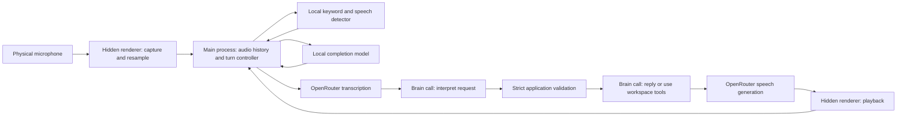

# Voice interface: architecture, behavior, and reliability audit

Audit date: September 6–7, 2026. Scope: installed 0.1.94, the 0.1.96 implementation, production diagnostic metadata, previous native/Electron/live-provider evidence, and new focused reproductions. This replaces the superseded audit at the same canonical path. The subsequent final review corrected findings V1–V5 before release; their original reproductions and resolutions are recorded below. The local installed application was not restarted during this work.

## Assessment

### September 8: Lina rename and local candidate verification

The renamed wake phrase initially failed 11/138 positive and 6/42 negative
synthetic cases. Keeping 32 keyword paths and explicit non-activating Lisa/Linda
alternatives repaired those cases. A held-out name sweep still found Nina/Rita
confusions, so candidates now receive an unrestricted local recognition pass
using the same bundled acoustic model and checksum-pinned BPE/hotword text.

The verifier retains four seconds of audio and tries at most three views: the
latest two speech onsets with 200 ms pre-roll, then the complete retained window.
This avoids the framing error that changed a real Zira greeting from `HELINA`
to `PALEONA` when 300 ms leading silence was added. It accepts only narrow Lina
greeting spellings with recent token times, never arbitrary transcript aliases.
Its 16-path decoder uses name bias 1 for normal audio and 2 when the existing
peak-0.15 normalization amplifies quiet audio, with gain capped at 8×. A fixed
strong bias admitted false names at normal volume; a fixed weak bias missed
the quiet noisy fixture. The measured level-based rule separates the retained
corpus without adding names to the rejection vocabulary.

The fixed corpus passes 138 positives, 114 negatives, 48 valid wakes following
rejected names, four spaced phrases and four old-wake replay cases. Native
token times must fall within real audio, within 800 ms of the candidate and
after the previous accepted wake; stale text alone cannot authorize a wake.
Keyword/VAD and completion remain separate local helpers, and verification
adds no cloud call, new acoustic model, or future-audio wait. Final native,
matrix and workflow reports are under `output/voice-handsfree`; these results
do not establish real-microphone accuracy or older-PC performance. Extremely
quiet, widely spaced greetings may still produce no first-stage candidate.

The final source matrix measured a 192 ms maximum packet and 0.055 maximum
real-time factor across positive, negative, recovery, replay and spaced cases
on a Ryzen 9 9950X. Startup measured 2.59 seconds with 162 MB process RSS after
one idle second. Independent yielding memory-soak evidence in
`.tmp/r11-wake-soak/soak-1788925258244.json` covered 1,200 clips: about 178 MB RSS
after initialization, a 276 MB sampled peak and 206 MB at completion, with
natural garbage-collection drops and no forced collection; its maximum packet
was 225 ms. Its continuous wake-only sequence, which did not reset after accepted
wakes, produced quiet-speech misses after loud prior audio;
the matching accepted-wake reset sequence passed 8/8 positives and 8/8 negatives,
and isolated normal Rita followed by quiet Lina passed 2/2. That artificial
continuous sequence is not a claim about the controller's recording lifecycle.

### Subsequent source improvements: wake sensitivity and conversation continuity

The expanded local keyword matrix reproduced eight quiet-speech misses across
David/Zira synthetic voices and speaking rates. A fixed, bounded onset gain on
the companion detector recovered them: 130/138 to 138/138 positive cases, with
42/42 negative cases and 4/4 spaced phrases passing before and after. The raw
primary stream, VAD and keyword threshold are unchanged. Reports are under
`output/voice-handsfree/keyword-matrix-before.json` and
`output/voice-handsfree/keyword-matrix-after.json`; these are synthetic regression
results, not physical microphone accuracy measurements.

Space can now interrupt a question during speech generation or playback without
losing its request, native generation/revision or earlier form answers. Follow-up
utterances carry their request identity, and both model stages receive bounded
context for that exact exchange even after unrelated requests displace recent
history. This context does not revive completed action grants. Natural explicit
choices such as “the second one” avoid an extra interpretation call; qualified
answers retain semantic routing. Four configured-Brain checks passed with
disposable workspace/history adapters, including a spoken title clarification
and its affirmative answer (`.tmp/orchestrator-conversation-live/1788818070870-41808/report.json`).

Parent verification passed 694 backend/Orchestrator/voice regressions, the renderer
build, capture and frontend voice checks, and the independent native keyword
matrix. Hidden Electron QA passed real Chromium fake-microphone capture through
the native helpers, reply acknowledgment and a second wake after playback
(`.tmp/voice-experience-smoke/1788818243569-39948/results.json`). The initial broad
run found an obsolete provisional-pane launch expectation from concurrent launch
work; its fixture now waits for the matching running process, and the final broad
run passed. No production launch behavior was changed by this voice work.

That checkpoint did not enable wake-word interruption during playback. A later
source update adds short spoken summaries and wake interruption during TTS
preparation/playback, as described in sections 6–7. It does not measure audible
output or update an already-running installed application.

The voice interface has working capture, local inference, cloud transcription, assistant execution, and audio playback components. This wider audit found defects where those components exchanged control, beyond the initial recording fixes. Final review corrected the reproduced handover, short-speech and stale-feedback defects in 0.1.96. Wake detection still pauses during transcription and assistant work; sequential cloud latency and microphone/assistant coupling remain product limitations. Physical microphone quality still needs direct measurement.

The most consequential findings at the start of the audit were:

1. Switching from an automatic recording to a short Space hold and back preserved an old silence timer and sent the recording too soon. Fixed before release.
2. A short, uncertain utterance remained recording through 40 seconds of silence. It now receives a bounded retry outcome.
3. Space silently failed with stale initial state or discarded capture errors. Both paths now have regression coverage and corrected state handling.
4. Saying “Hey Lina” during transcription, assistant work, or playback was ignored. The current source accepts it during speech preparation/playback when hands-free detection is enabled and ready.
5. Even successful requests pass through several sequential cloud operations before sound starts.
6. “Mute microphone” also disables the text Orchestrator. A microphone failure can take the text assistant down with it.

These are distinct problems. Increasing wake sensitivity alone would not resolve them.

## 1. Version and evidence boundaries

At the start of this audit, the installed executable reported **0.1.94**. Its keyword and turn-completion helpers were running. Saved settings had hands-free enabled, the system-default microphone, English transcription, `z-ai/glm-5.3-flash`, `openai/whisper-large-v3-turbo`, and Kokoro `af_heart`. Automatic microphone startup was off.

| Behavior | Installed 0.1.94 at audit start | 0.1.96 |
| --- | --- | --- |
| Earliest confident automatic commitment | 200 ms classified quiet | 1,200 ms classified quiet |
| Low-confidence result followed by silence | Can wait until recording limit | Sends after 3 seconds quiet with at least 250 ms speech; shorter uncertain speech gets a retry without transcription upload |
| Automatic recording control | Hold/release Space or mouse | Also offers identity-bound click-to-send |
| Main microphone status | Primarily tooltip/accessibility text | Color-only indicator with screen-reader status; floating text removed September 9 at user request |
| Invalid assistant interpretation | Request fails | Explicit format guidance and one repair attempt |
| Voice diagnostics | Timing values discarded by sanitizer | Bounded timing, confidence and automatic-recording events retained |

The following sections describe the **0.1.96 implementation**, with installed behavior called out where material. Findings explicitly marked as audit reproductions describe the pre-correction candidate. Passing tests do not establish that a running installation has applied the update.

## 2. The complete path



This is a staged voice-command system. The local wake detector does not transcribe the request. The completion model does not operate terminals. The cloud assistant does not directly own microphone capture.

The separation is useful: each component has a narrower responsibility, and terminal actions remain subject to application checks. It also creates several transitions that must agree about whether the user is still speaking, whether a request has been cancelled, and which recording or terminal a result belongs to.

| Component | Responsibility | Runs locally? |
| --- | --- | --- |
| `VoiceMicrophone` and AudioWorklet | Read microphone, resample, frame audio, flush final samples | Yes |
| sherpa-onnx keyword model | Detect the configured English wake phrase | Yes, CPU |
| Silero VAD | Classify whether recent audio contains speech | Yes, CPU |
| Smart Turn | Estimate whether the speaker has finished the turn | Yes, CPU |
| Whisper through OpenRouter | Convert a completed recording into text | No |
| Configured Brain | Interpret the request, then answer or operate the workspace | No |
| Kokoro through OpenRouter | Generate the spoken response | No |
| `PcmPlayer` | Schedule and play returned audio | Yes |

Sherpa describes its keyword spotter as a small recognizer constrained to supplied phrases; the phrase can be configured without retraining. Its threshold trades missed detections against false activations. [Sherpa keyword-spotting documentation](https://k2-fsa.github.io/sherpa/onnx/kws/index.html).

Smart Turn estimates completion from the waveform. It is not checking a transcript for a period or deciding whether a workspace request is valid. Its documented usage takes 16 kHz mono audio and limits the analysis window to roughly the latest eight seconds. [Smart Turn model card](https://huggingface.co/pipecat-ai/smart-turn-v3), [upstream inference guidance](https://github.com/pipecat-ai/smart-turn/blob/main/README.md).

## 3. What enabling voice actually does

The settings form maintains a draft. Checking Hands-free changes the draft; saving applies it. Turning Orchestrator on first saves and verifies the draft, then enables the application service. The checkbox therefore describes the chosen setting, while the readiness message describes whether the runtime actually started.

The main process performs these steps:

1. Check remembered app consent and operating-system microphone permission.
2. Enable the relay and validate the selected Brain.
3. Validate transcription availability and the app-supported speech model/voice.
4. Create or reuse the permanently hidden audio renderer.
5. Wait for its readiness acknowledgment.
6. Assign a new capture token and request microphone capture.
7. Wait for the microphone acknowledgment.
8. Start local inference when hands-free is enabled.

Microphone capture and hands-free inference have separate readiness states. An open microphone can be ready for Space while the wake helpers are loading or unavailable. A successful settings save or cloud model check does not prove that a physical wake phrase will be recognized.

The hidden audio renderer is sandboxed, non-focusable, omitted from the taskbar, and kept alive when the visible microphone indicator is hidden. Its background throttling is disabled. Hiding the microphone is intentionally different from turning voice off.

Sources: [settings UI](../frontend/components/OrchestratorSettings.tsx), [activation and configuration](../backend/orchestratorIntegration.cjs#L438), [hidden audio renderer](../backend/voiceOverlayWindow.cjs), [microphone consent](../backend/microphonePermission.cjs).

## 4. Microphone capture and wake detection

The microphone stays open while voice is enabled, including during idle listening. Capture requests mono audio, echo cancellation and noise suppression, with automatic gain control explicitly disabled so Lina does not request automatic input-level adjustments. The settings microphone-refresh capture also disables automatic gain control. It uses the selected device ID exactly, or the system default when no ID is saved. There is no automatic fallback from an unavailable explicitly selected microphone.

The AudioWorklet converts the actual input sample rate to 16 kHz, then sends 320 samples per packet: **20 milliseconds of audio**. Packets carry a capture token and increasing sample positions. A zero-gain output connection keeps the audio graph active without playing microphone input through the speakers.

The controller retains two seconds of recent audio. When wake detection fires or a manual hold begins, that history is prepended to the recording. This protects speech that started before activation was recognized, but the eventual transcription upload includes that retained audio too.

Keyword processing uses a continuous stream and a second stream refreshed around speech onsets. The second stream replays 300 ms of history and has a two-second refresh cooldown. This attempts to reduce framing/context misses without repeatedly resetting the continuous detector.

The current configuration uses keyword threshold 0.25, one trailing blank, and a single CPU thread. Silero uses threshold 0.5, 64 ms minimum speech and 32 ms minimum silence. These are implementation settings, not demonstrated accuracy guarantees for every voice or room.

The keyword/VAD helper and completion helper are separate processes because their ONNX Runtime libraries are incompatible in one Windows process. Both must initialize before hands-free reports ready.

Sources: [capture implementation](../frontend/voice/microphone.ts), [capture lifecycle](../frontend/VoiceOverlay.tsx), [keyword/VAD implementation](../backend/voiceKeywordModel.cjs), [helper service](../backend/voiceInferenceService.cjs), [pinned assets](../vendor/voice/models/manifest.json).

## 5. What starts and stops a recording

There are three recording origins: wake, automatic answer to a question, and manual push-to-talk. The controller preserves the origin even when a Space hold temporarily takes over an automatic recording.

| Situation | Current behavior |
| --- | --- |
| Wake while idle and helpers ready | Start automatic recording with pre-roll |
| 200 ms quiet after post-wake speech | Ask Smart Turn for a completion estimate |
| Confident completion | Commit only after at least 1.2 seconds uninterrupted classified quiet |
| Uncertain completion, at least 250 ms classified speech | Commit after 3 seconds quiet |
| Uncertain completion, less than 250 ms speech | After 3 seconds quiet, cancel without transcription upload and give retry feedback; a current agent question is repeated through TTS |
| Wake with no post-wake speech | Give six seconds, transcribe retained audio, suppress wake-only text |
| Automatic recording reaches total audio limit | Cancel at 60 seconds rather than send continuously unfinished speech |
| Manual hold under 300 ms | Treat as a tap and cancel, or hand control back to the adopted automatic turn |
| Manual hold at least 300 ms | Flush and send on release |
| Manual recording reaches maximum length | Send even if the key remains held |
| Click Send during automatic recording | Flush and finish only the identified current automatic recording |

There is one completion analysis per unchanged speech revision. Additional speech invalidates the old prediction. The controller waits for VAD to classify already received packets before accepting a completion result, so queued speech can veto an apparent pause.

Automatic and manual recordings use different evidence for very quiet speech. Automatic recording can accept neural speech detection even when amplitude is low. An ordinary manual hold requires at least 250 ms of RMS-voiced audio, including pre-roll, before upload. The two modes are consequently not identical audio gates.

A short command spoken entirely before wake detection finishes can remain in the six-second grace path because its words are in pre-roll rather than counted as post-wake command speech. Its audio is retained, but the extra delay remains.

Sources: [recording and inference decisions](../backend/voiceController.cjs#L120), [manual handover](../backend/voiceController.cjs#L246), [audio recording](../backend/voiceAudio.cjs).

## 6. Why repeating “Hey Lina” sometimes does nothing

Wake detection now remains active during speech preparation and playback when
hands-free voice is enabled. Transcription and assistant work still pause wake
detection.

| Phase | Wake phrase accepted? | Space accepted? | Main microphone action |
| --- | --- | --- | --- |
| Off | No | No | Enable and hold |
| Idle listening, helpers ready | Yes | Yes, subject to focus guards | Hold to talk |
| Automatic recording | No new wake turn | Yes; adopts recording | Send |
| Awaiting an agent answer | Uses speech detection without another wake | Yes | Hold to answer |
| Transcribing | No | No | Stop request |
| Thinking | No | No | Stop request |
| Preparing speech / speaking | Yes, with hands-free voice enabled and ready; interrupts speech | Yes; interrupts playback | Hold to interrupt and talk |

“Hey Lina” interrupts a spoken response or its pending TTS request, cancels old
queued speech, and captures the new command. It retains a current question's
answer identity without cancelling terminal work. A slow transcription or Brain
request still uses the Stop request control. The microphone requests echo
cancellation, but real loudspeaker/microphone recognition remains a physical
verification boundary.

Space is a **window keyboard listener**, not a system-wide hotkey. It is ignored while typing inside a terminal pane, input, textarea, select or editable field. The idle label still says “hold Space” even in those contexts. Losing window focus during a sufficiently long manual hold sends the recording.

The visible mic changes appearance by phase. It is not a microphone level meter. A glowing or pulsing button does not prove that the selected microphone is delivering intelligible speech.

There is no audible wake acknowledgment. In another application, the in-window visual change may be invisible to the speaker. A short optional local cue would help distinguish activation from silence, provided its interaction with capture and echo cancellation is tested.

Sources: [detection mode selection](../backend/voiceController.cjs#L75), [manual busy/barge-in rules](../backend/voiceController.cjs#L264), [Space listener and focus guards](../frontend/VoicePushToTalk.tsx), [visible controls](../frontend/VoiceIndicator.tsx).

## 7. What happens after recording

The completed audio becomes a WAV in memory and is uploaded as base64 JSON to OpenRouter transcription. The app waits for the full transcription response. Only then does it remove a leading wake phrase from a wake-origin transcript. A wake-only result does not reach the assistant.

The configured Brain normally runs **twice before a simple spoken reply**:

1. An interpretation call returns an `interpret_workspace` plan. It receives the user request and bounded application identity/context metadata. Terminal output, private diagnostics, and assistant prose cannot create authority here.
2. Application code validates the plan and creates scoped grants. A separate executor call answers or uses workspace tools within those grants. It can request additional bounded output/history/file context, which may add further model calls.

The same selected model serves both roles. This is not two separately selected models. The extra validation step helps prevent a model from inventing target identities, answers, or repeated effects. It also adds latency and another response-format boundary.

The production error at **2026-09-07 00:05:40 UTC** occurred at this interpretation boundary: `Invalid or unexpected intent fields.` Its stack showed `normalizeIntent` called from the voice request path. That establishes a real downstream failure after a voice attempt reached the assistant. It does not establish which extra field the model returned, because the log intentionally omits raw replies.

Version 0.1.96 supplies a clearer argument-shape contract and allows one repair attempt using the original authorized context. The strict validator remains in place. Repeated failure still stops the request. This improves recovery; it does not prove the selected provider will always follow the contract.

Confirmed orchestrator command completion now replies with `done`, with a short
local ding before the selected voice speaks it. The cue uses the same ordered
PCM playback, mute and interruption controls. Sending a prompt completes the
send action; the agent's later result remains separately tracked. Queued or
unconfirmed delivery, failed or blocked actions, and questions retain their
explanations and never trigger the completion cue. Routine terminal completion
and missing-result notices are omitted from the conversation view; shared result
summaries appear once per identified terminal turn. Underlying request-owned
records remain intact. Failures and questions still speak.

Other spoken replies and agent completion reports use a separate natural TL;DR,
with its level of detail chosen by the model rather than fixed sentence, word,
or character caps. Written replies stay intact. The model normally supplies
`speechText` alongside its written reply in the same response. A missing summary
gets one tool-free summary attempt; automatic completion reports reuse their
existing summary call. Empty or failed summaries produce a brief fallback
instead of reading raw agent output. Clarifications and permission
questions preserve their wording. Kokoro receives the selected text with
Markdown normalized; the app supports its ten configured English voice presets.

PCM speech is validated and progressively emitted to the hidden renderer as
ordered chunks. WAV containers remain fully buffered for validation. The renderer
schedules playback and acknowledges completion. The `speaking` phase begins
before the TTS request, so it can appear before sound is available; wake
interruption works during that preparation too.

The controller cancels the active request and playback identity on interruption.
Late provider, inference, and playback callbacks are fenced from the new capture.

Sources: [transcription and dispatch](../backend/voiceController.cjs#L294), [interpretation and repair](../backend/orchestrator.cjs#L147), [strict grants](../backend/orchestratorIntent.cjs#L97), [executor loop](../backend/orchestrator.cjs#L441), [speech download/playback](../backend/voiceController.cjs#L376).

## 8. Latency and deadlines

For a normal voice reply, perceived delay contains all of these terms:

`end-of-speech wait + transcription + interpretation + executor work + TTS generation/download + playback startup`

Local detection is only one portion. The earlier native tests measured completion-model execution in tens of milliseconds on this development machine. They do not imply a response will be heard in tens of milliseconds.

The final previous live synthetic test recorded these HTTP waits:

| Operation | Fetch-to-response-headers measurement |
| --- | ---: |
| Transcription | 637 ms |
| Interpretation | 1,026 ms |
| Executor reply | 5,402 ms |
| Speech generation | 362 ms |
| Sum | 7,427 ms |

This is one test, not a latency distribution. The harness measured response headers, not complete body parsing, decoding, or sound at the speaker. These waits are sequential, so their sum illustrates substantial delay before playback; it is not a measured total audible response time. The test also bypassed microphone endpointing by submitting a generated WAV directly.

| Boundary | Limit |
| --- | ---: |
| Hidden renderer readiness | 15 seconds |
| Initial microphone readiness | 15 seconds |
| Both model helpers ready | 15 seconds |
| Worklet flush | 1 second, with a 1.5-second main-process deadline |
| Queued local inference audio | 500 ms |
| Individual local frame response | 2 seconds |
| Completion-model response | 1 second |
| Transcription request | 60 seconds |
| Each Brain request | 45 seconds |
| Speech request | 120 seconds |
| Playback acknowledgment | Decoded duration plus 5 seconds |

There is no single end-to-end interaction deadline. Repairs, reasoning-budget retries and additional workspace-tool rounds can extend a turn. Cancellation must therefore be obvious and dependable.

The current source measures stage boundaries and renderer playback start, and
streams validated PCM before EOF. These timings do not measure physical speaker
audibility. An ordinary reply missing its spoken-summary field needs one
additional TL;DR call before TTS; replies with that field, app-generated status
messages, and automatic result reports avoid the extra call.
Reducing or combining Brain calls must retain the authorization boundary.

Evidence: [previous live result](../.tmp/voice-live-validation/1788740715547/result.json), [native report](../output/voice-handsfree/native-smoke.json), [request timeout](../backend/orchestrator.cjs#L125), [speech buffering](../backend/voiceController.cjs#L417).

## 9. Newly reproduced defects and remaining risks

The original reproductions used the pre-correction candidate's real application
modules with controlled inputs. They established code behavior, not occurrence
rates in the user's acoustic environment. **V1–V5 are now corrected and covered
by release regression tests. V6 remains an intentional product coupling.**

| ID | Priority | Finding | Evidence and implication |
| --- | --- | --- | --- |
| V1 | High | Old silence survives automatic → Space → automatic handover | 500 ms speech, 2,900 ms quiet, 100 ms new speech during a short Space hold, then 100 ms quiet produced an upload. The controller counted 3,000 ms silence despite only 100 ms quiet after the new speech. |
| V2 | High | Space discards action failures | A failed stop/flush returned an error, but the separate Space helper supplied no feedback callback; the indicator continued to show readiness. |
| V3 | High | Space can use stale startup state | A live listening event followed by a late initial `getState()` result of off left Space issuing no start call. Other voice subscribers have a guard against this ordering. |
| V4 | Medium | Short uncertain speech lacks a bounded completion path | 200 ms classified speech and probability 0.2 remained recording after 40 seconds quiet, with only one analysis. It fails the 250 ms fallback requirement. |
| V5 | Medium | A late manual mouse error can overwrite a new turn | A delayed PTT stop failure arriving after a new automatic recording replaced its Listening status. The recent error fencing covers `act()`, but not the PTT helper callback. |
| V6 | Medium | Microphone controls are coupled to the entire assistant | Calling the UI's voice-listening off endpoint disabled the relay. A simulated microphone failure and denied microphone consent also disabled or prevented the text Orchestrator. |

**V1 fixed:** handback now resets silence and the classification boundary while
retaining recorded audio. New quiet must accumulate after the handback; old
predictions cannot commit it. [Handover code](../backend/voiceController.cjs).

**V2/V3 fixed:** Space ignores initial snapshots that arrive after live state.
Current-hold flush failures are published through shared backend voice state;
obsolete holds cannot mark a newer turn as failed. Off/busy start refusals also
publish feedback. [Space subscriber](../frontend/VoicePushToTalk.tsx),
[flush handling](../backend/orchestratorIntegration.cjs).

**V4 fixed:** after three seconds quiet, uncertain short speech cancels without
transcription or dispatch and gets a bundled retry prompt for a wake-origin turn.
A still-current agent question is repeated through cloud TTS and remains answerable.
Confident short answers retain the
normal semantic-completion path. [Completion policy](../backend/voiceController.cjs#L145).

**V5 fixed:** manual helper replies no longer write a separate mouse-only error.
Automatic Send captures recording ID, source and revision; stale pointer releases
are discarded before IPC. Pending errors cannot cross into a new turn or a manual
adoption of the same turn. Final review reproduced and corrected that latter
pointer race too. [Indicator action scopes](../frontend/VoiceIndicator.tsx).

**V6 product decision needed:** separate assistant availability from microphone availability, or label the coupled operation accurately. A text assistant should be able to stay usable after microphone trouble. [Enable/disable coupling](../backend/orchestratorIntegration.cjs#L477).

Capture-health follow-up fixes now in the workspace: the 500 ms fatal backlog
threshold is replaced with bounded queued dispatch; completion-helper failure is
isolated from keyword/VAD; keyword faults retry automatically with a rolling
budget. Renderer and main-process PCM heartbeats restart stalled capture with
fresh identities, preserving current question routing while cancelling partial
audio. Native helper errors retain bounded helper/stage details. These changes
require a rebuilt application; see [current recovery limits](voice-handsfree.md#recording-and-failure-behavior).

The original additional risks and their current disposition:

- **Residual wake speech:** the controller treats any post-detection VAD speech as command speech. A controlled 100 ms wake tail plus a confident completion prediction causes submission after 1.2 seconds, potentially before a delayed command. The earlier native delayed-command fixture passed because it did not classify residual wake speech. This is a conditional mechanism, not a reproduced physical-microphone failure.
- **A capture graph that stops delivering without an error — corrected in source:** PCM heartbeats now detect absent packets separately from silence, attempt a bounded suspended-context resume, and recreate capture with a fresh token. Old frames/acknowledgments cannot finish the replacement recording. Persistent faults are reported after bounded retries; no automatic retry survives mute or shutdown.
- **Accessible button activation:** the large mic relies on pointer events; a conventional click activation has no handler. Enter is implemented for automatic Send, but not for enabling the large mic or stopping a working request. Accessible labels and focus outlines help, but do not replace complete activation behavior.

A proposed settings-save race was excluded from the findings: a direct-handler harness could edit during Save, but the actual disabled fieldset prevents that user action. Likewise, unproven external settings drift is not presented as an established user-facing defect.

Maintained regression commands for the corrected paths, using controlled inputs:

```text
node --test scripts/backend/voice-handsfree.test.cjs scripts/backend/voice-lifecycle.test.cjs
npm run smoke:frontend:voice-experience
npm run test:voice:capture
```

## 10. What the logs establish—and what they cannot establish

The installed log contained 1,966 stream events, four completion events and one Brain error when sampled for this audit. Stream events prove that local inference processed packets at those times. They do not prove that speech was loud enough, the right input device was selected, or every wake phrase was recognized.

The Brain error proves that a voice attempt reached interpretation and failed there. Its exact original response arguments are unavailable. The old logger discarded the numeric inference timings and did not record automatic recording starts/finishes, so it cannot reconstruct the complete acoustic sequence surrounding that failure.

Version 0.1.96 adds timing values, completion confidence, recording identity and start/finish/cancel reasons. Useful evidence is still missing: actual input level, packet age, per-turn timestamps for every cloud stage, and renderer playback-start timing.

Native helper exceptions are also reduced to generic failure messages. A load error, inference failure and runtime problem can therefore be hard to distinguish. A future diagnostic should preserve a bounded error class/code and stage without logging microphone audio, transcripts, or raw model arguments.

Source: [diagnostic sanitizer and rotation](../backend/orchestratorDiagnostics.cjs), [helper failures](../backend/voiceInferenceService.cjs#L36), [keyword host](../backend/voiceKeywordHost.cjs), [completion host](../backend/voiceTurnHost.cjs).

## 11. Privacy, storage, costs and safeguards

Idle wake processing stays local. After a turn is committed, the complete retained recording is sent for cloud transcription. Prefix removal happens after transcription; it does not remove the wake phrase or pre-roll from the uploaded WAV.

The interpreter receives the request and bounded workspace identity metadata. The executor can additionally receive selected terminal output, history, files and saved preferences when needed. Generated reply text goes to the speech provider. Local-only wake detection therefore does not make the entire assistant local.

Persistent application settings include model choices, devices, toggles, explicit preferences and an encrypted API key. Persistent keys use operating-system secure storage; session-only keys remain in memory. Preferences are ordinary settings data, not encrypted with the key.

No production audio/transcript disk-writing path was found in the audited voice and relay modules. Audio buffers, recent conversation, transcript, reply and usage live in memory there. Terminals that receive prompts may independently store their own histories. The synthetic QA harness intentionally creates its own WAVs and reports under `.tmp`; that is separate from production recording behavior.

Private diagnostic files retain operational metadata and bounded errors, including possible file paths in stacks. They exclude raw audio/transcript fields and redact keys. Rotation keeps a current file plus two backups at approximately 1 MiB each. No automatic diagnostic-upload path was found. Provider retention policies cannot be inferred from application source.

Usage is based on provider-reported costs. TTS billing uses a best-effort generation lookup; missing metadata can leave speech usage at zero. The previous successful live test did report zero speech usage despite receiving audio. This should be displayed as unknown or pending, rather than interpreted as free speech generation.

The spending limit is a soft threshold against known session costs. It does not reserve costs before all in-flight requests or every repair, and it resets with in-memory session usage. It should not be described as a guaranteed account billing cap.

The strongest existing safeguards should be preserved: generation-bound terminal grants, literal answer matching, capture/turn/hold identities, stale-result rejection, verified audio formats, bounded inference queues, hashed model/error assets, and cancellation of future work. None of these can undo an already executed terminal command or an already incurred provider charge.

Sources: [settings storage](../backend/orchestratorSettings.cjs), [voice request/cost handling](../backend/voiceController.cjs), [assistant context and grants](../backend/orchestrator.cjs), [audio decoding](../backend/voiceAudio.cjs), [diagnostics](../backend/orchestratorDiagnostics.cjs).

## 12. Recommended repair order and acceptance checks

**Completed before release:** V1–V5 and the final-review pointer race have scoped
regression tests and corrected handling. **Capture-health follow-up completed in
source:** wall-clock packet checks, bounded restart, failure isolation and stale
recovery tests now cover transport/graph stalls separately from inference errors.

**Second: make the interface explain its state.** Keep the compact microphone, but show the selected device, actual input activity, recording duration and explicit Listening / Transcribing / Working / Preparing speech / Playing states. Make Send and Cancel ordinary accessible controls. Clarify the terminal-focus Space guard. Add an optional wake cue and a local microphone test that does not dispatch workspace commands.

**Third: separate failures.** Assistant enabled, microphone enabled, wake ready and interaction phase should be distinct concepts. Losing the microphone should not disable text operation. A temporary completion-helper problem should produce a specific, recoverable explanation.

**Fourth: reduce measured latency.** Add timestamps at capture commitment, STT body completion, valid intent, final assistant text, TTS first byte, decoded audio and renderer playback start/end. Measure cold and warm runs. Then consider progressive TTS and a faster interpretation path while retaining strict authorization and cancellation.

**Fifth: validate the physical experience.** Use the actual microphone, real room conditions and audible speakers, with consent for each collected test recording. A useful matrix includes immediate commands, one- and two-second wake gaps, mid-sentence pauses, short yes/no/stop responses, quiet speech, background sound, repeated wakes, headset changes and requests during playback. Measure missed wakes, false activations, clipped words, time to first sound and recovery after failure. Report results per condition rather than one overall pass percentage.

| Acceptance area | Required observation |
| --- | --- |
| Manual/automatic handover | Speech captured during a short hold restarts the quiet window; no inherited early send |
| Short utterance | Every detected short attempt reaches a bounded send/retry/cancel outcome |
| Keyboard boot and errors | Late snapshots cannot regress readiness; failed start/flush/stop is visible |
| Stale actions | A retired key, pointer, capture or provider result cannot alter a newer turn |
| Input health | Device loss, suspended graph and absent packets produce specific feedback |
| Text independence | Muting or losing a microphone preserves intended text-only operation |
| Playback | Status distinguishes waiting for audio from actual playback; cancellation stops queued sound |
| Wake reliability | Physical repetitions across gaps, levels and background conditions are measured |
| Cloud behavior | Contract violations stay bounded and cannot widen workspace authority |

## 13. Verification ledger

The investigation reused earlier evidence and ran focused additional
reproductions without more authenticated provider calls. The subsequently
requested cleanup was checked with the full 470-test backend suite, the build,
frontend/capture checks and the migrated Electron history/context smoke.

| Evidence | What it establishes | Limit |
| --- | --- | --- |
| Earlier 470 backend tests and affected final interpretation tests | Tested controller, ownership, action, format and error contracts | Do not cover every ordering or acoustic condition |
| Earlier native model smoke | Bundled keyword/VAD/completion models operate on synthetic fixtures | Does not establish physical microphone accuracy |
| Earlier real-model/controller workflow smoke | Two-second wake gap, mid-command pause and wake-only handling for supplied fixtures | Synthetic speaker and stubbed transcription/relay |
| Earlier Electron voice smoke | Chromium capture, wake, completion, playback acknowledgment, repeat wake and pointer Send | Fake microphone; provider replies scripted; output silenced |
| Final prior live synthetic run | Configured STT, Brain and TTS produced a valid reply and decodable audio | Bypasses wake/capture, auto-acknowledges playback, no real workspace effects |
| D1/D2 and parent integration reproductions | Original state/silence/feedback defects, subsequent corrected outcomes, and retained microphone/relay coupling | Controlled event ordering; not occurrence-rate measurements |

An earlier live attempt genuinely failed interpretation. A later attempt failed because of the diagnostic harness itself and was excluded. Subsequent live calls succeeded. This small, heterogeneous set does not support a provider reliability percentage or a claim that the exact original malformed field has been fixed.

Final local verification passed all 42 release checks, including 476 backend
tests and the paced native voice workflow. The release workflow also gates
publication on packaged inference and the real Electron voice/context tests.
These checks cover the corrected transitions; physical microphone accuracy and
audible playback quality remain separate acceptance work.

The initial v0.1.95 publication attempt passed the build and packaged-inference
checks but stopped before publication because the UI test executable was absent
from a clean npm install. Version 0.1.96 adds explicit, version-checked Electron
test-runtime preparation. The voice/history gates remain mandatory.

## Repository cleanup performed with this audit

- Replaced the old deep dive here, keeping one canonical audit rather than a
  second date-named document.
- Removed the superseded voice-fixes, experience-audit and validation documents.
  Current contracts remain in the hands-free/PTT guides; historical transport
  verification boundaries were consolidated into the harness review.
- Removed unused PCM-framing and synthesized-chime helpers, their obsolete
  assertions, and unused helper exports. Current PCM decoding and error-clip
  tests remain.
- Replaced the obsolete combined audio/context smoke with
  `smoke:electron:context-history`. It preserves Unicode pagination, search/jump,
  source-hash and no-provider checks. Current audio coverage remains in the
  voice-experience smoke.
- Corrected stale local/cloud, setup, gesture and result-type descriptions and
  updated the documentation index and script references.

Original audit scripts remain local evidence under `.tmp`. The release-blocking
reproductions were converted into passing production regression tests during
the subsequently authorized final review; remaining product and hardware limits
are explicitly retained above.
